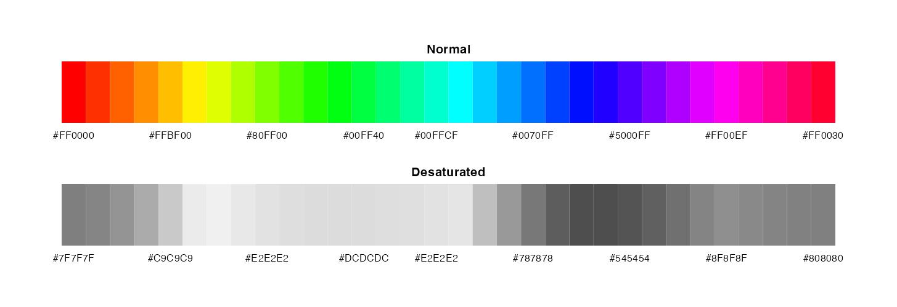
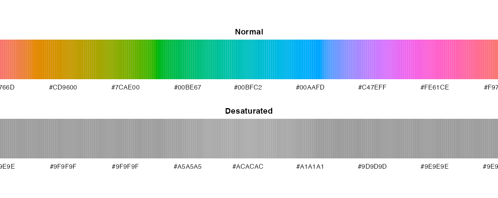
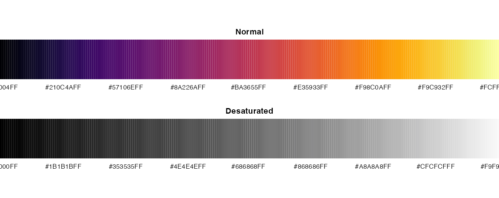
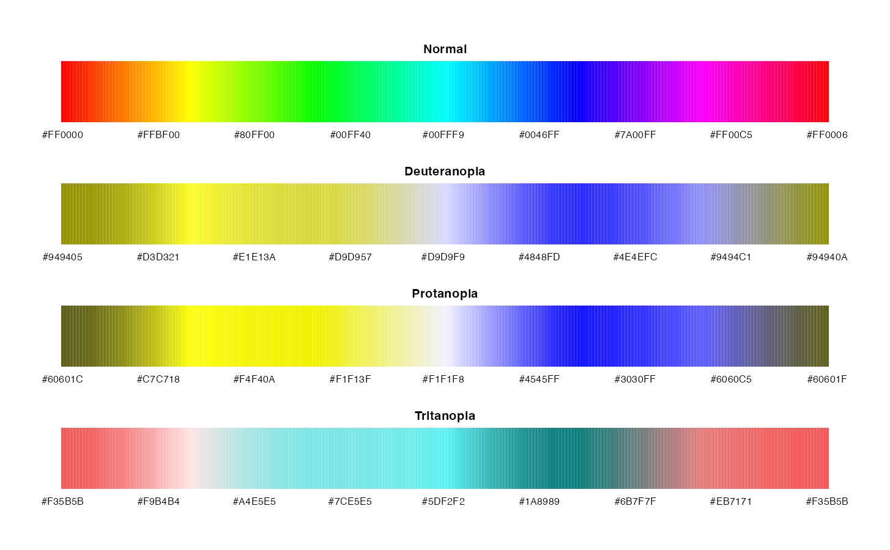

<!-- README.md is generated from README.Rmd. Please edit that file -->

```{r setup, include=FALSE}

```

```{r include=FALSE}
library(paletteer)
```

# Comprehensive list of color palettes in R

The goal of this repository is to have a one stop destination for anyone looking for a color palette to use in r. If you would like to help/contribute please feel free post an issue, PR or send a email to [emilhhvitfeldt@gmail.com](mailto:emilhhvitfeldt@gmail.com).

Interactive R Color Palette Pickers:

- [https://emilhvitfeldt.github.io/r-color-palettes/](https://emilhvitfeldt.github.io/r-color-palettes/)
- [https://r-graph-gallery.com/color-palette-finder](https://r-graph-gallery.com/color-palette-finder)

Further down the page is all the palettes available in the R ecosystem ordered alphabetically by package name. A list of palettes ordered by type can be found here [Type sorted palettes](type-sorted-palettes.md) to shorten the length of this page.

## Paletteer package

I have collected all the palettes displayed here in a single package using a unified framework. Developmental version can be found [here](https://github.com/EmilHvitfeldt/paletteer).

You can install the released version of paletteer from [CRAN](https://CRAN.R-project.org) with:

```{r, eval=FALSE}
install.packages("paletteer")
```

If you want the development version instead then install directly from GitHub:

```{r, eval=FALSE}
# install.packages("pak")
pak::pak("EmilHvitfeldt/paletteer")
```

```{r child="toc"}
```

## Blogposts and other resources

Here is a collection of material on the use and creation of color palettes in r.

- [Creating corporate colour palettes for ggplot2](https://drsimonj.svbtle.com/creating-corporate-colour-palettes-for-ggplot2)
- [Make your own color palettes with paletti](https://edwinth.github.io/blog/paletti/)
- [How to create a color palette in R with more than 15 colors with ggplot2 ](https://github.com/duttashi/visualize/issues/19)
- [Generating a Custom Color Palette Function in R](https://quantdev.ssri.psu.edu/tutorials/generating-custom-color-palette-function-r)
- [How to build a color palette from any image with R and k-means algo](http://www.milanor.net/blog/build-color-palette-from-image-with-paletter/)
- [Why choice of colour is important beyond aesthtic considerations and how the quality of a palette might be assesed](https://www.data-imaginist.com/2018/scico-and-the-colour-conundrum/)
- [Viz palette: colors in action](http://projects.susielu.com/viz-palette)

## Color manipulation packages 

- [Extract palettes from images and text](https://github.com/EmilHvitfeldt/quickpalette)
- [Fast Vectorised Colour Conversion and Comparison](https://github.com/thomasp85/farver)
- [How to Read, Inspect, and Manipulate Color Swatch Files](https://github.com/hrbrmstr/swatches)
- [Simple colour manipulation in R](https://github.com/jonclayden/shades)

## Generative packages

The purpose of this project is to showcase the palettes already available in R (packages). However sometimes you have to resort to make one yourself. When that is the case the following packages aides in creating.

- [AndreaCirilloAC/paletter](https://github.com/AndreaCirilloAC/paletter)
- [jolars/qualpalr](https://github.com/jolars/qualpalr)
- [ronammar/randomcoloR](https://github.com/ronammar/randomcoloR)
- [johnbaums/hues](https://github.com/johnbaums/hues)
- [ColorPalette](https://cran.r-project.org/web/packages/ColorPalette/index.html)
- [oaColors](https://cran.rstudio.com/web/packages/oaColors/index.html)
- [earthtones](https://cran.r-project.org/web/packages/earthtones/index.html)
- [leeper/colourlovers](https://github.com/leeper/colourlovers)

When creating color palettes certain website have also provided valuable

- [paletton](http://paletton.com/)
- [Data color picker](https://learnui.design/tools/data-color-picker.html)
- [i want hue](http://tools.medialab.sciences-po.fr/iwanthue/)
- [Viz Palette](http://projects.susielu.com/viz-palette)

## Perception of color palettes

Selecting a color palette requires a number of different considerations. Within these considerations is

- the palette retains its integrity when printed in black and white
- people with colorblindness are able to understand it

In the following I have outlined a couple of those problems

### Printing in black and white

While most of the palettes presented here contains a wide variety of colors. While that is compelling, you need to remember that your product might be printed in black and white one day, and you should pick a palette that allows for interpretation if that is the case.  

First example is the `rainbow` palette from the `grDevices` package with its colorful display. However as we see here would it be horrible if used for black and white printing since different colors are mapped to the same shade of grey.

```{r, fig.height=3}
source("palette_plotter.R")

pal_data <- list(
  Normal = rainbow(32),
  Desaturated = colorspace::desaturate(rainbow(32))
)

make_plot(pal_data, "readme-1")
```

Standard rainbow palette



A related problem happens with the standard color palette used in `ggplot2` since that color is picked to have constant chroma and luminance thus yielding the same shade of grey when desaturated. (This palette is no longer the default for continuous variables in `ggplot2` after version 3.0.0)

```{r fig.height=3}
pal_data <- list(
  Normal = scales::hue_pal()(256),
  Desaturated = colorspace::desaturate(scales::hue_pal()(256))
)

make_plot(pal_data, "readme-2")
```

Standard color palette for ggplot2



One of the continuous palette that satisfy this criteria is the well known `viridis` palettes.

```{r fig.height=3}
pal_data <- list(
  Normal = viridis::inferno(256),
  Desaturated = colorspace::desaturate(viridis::inferno(256))
)

make_plot(pal_data, "readme-3")
```

inferno palette from viridis



To test if the palette you want to use will be distorted when in black and white, use the `colorspace::desaturate()` to desaturate it. 

### Color blindness

Another thing you have to take into consideration when picking a palette is how it would be viewed by a person who is [color blind](https://en.wikipedia.org/wiki/Color_blindness). There are several approaches to ensuring that a colorblind person can interpret your figures. A very good summary of what you can do is given by Masataka Okabe and Kei Ito in their document ["Color Universal Design (CUD) - How to make figures and presentations that are friendly to Colorblind people"](http://jfly.iam.u-tokyo.ac.jp/color/). Beyond using shapes, linetypes and size for information coding, which is easily done using the [ggplot2 aesthetics](https://ggplot2.tidyverse.org/reference/aes_linetype_size_shape.html), they recommend:

#### Using unambiguous palettes

The easiest way to make color coding accessible to everyone, is using a palette, that is unambiguous to people with various types of color blindness. There are a few available:

* Masataka Okabe and Kei Ito have developed such a [barrier free palette](http://jfly.iam.u-tokyo.ac.jp/color/#pallet), and you can use it in R with the [colorblind_pal() of the `ggthemes` package](https://jrnold.github.io/ggthemes/reference/colorblind.html) (also see colorblind_pal palette among the ggthemes palettes in the alphabetical list below) or by using the encoding provided by the [Cookbook for R](http://www.cookbook-r.com/Graphs/Colors_(ggplot2)/#a-colorblind-friendly-palette).
* Some of the palettes developed by Cynthia Brewer for the [ColorBrewer](http://colorbrewer2.org) are colorblind safe, you can find them through the [palette chooser website's button "colorblind safe"](http://colorbrewer2.org). In R, you can use the brewer palettes through [`ggplot2`'s scale_colour_brewer() et al.](https://ggplot2.tidyverse.org/reference/scale_brewer.html) or through the separate package [`RColorBrewer`](https://cran.r-project.org/web/packages/RColorBrewer/index.html).

#### Simulating effects of color blindness on used palettes

To visualize the effect of color blindness on our palettes we will turn to two packages. The `dichromat` package can simulate color blindness on individual color and then also entire palettes like so in this `rainbow` palette:

```{r}
pal_data <- list(
  Normal = rainbow(256),
  Deuteranopia = dichromat::dichromat(rainbow(256), type = "deutan"),
  Protanopia = dichromat::dichromat(rainbow(256), type = "protan"),
  Tritanopia = dichromat::dichromat(rainbow(256), type = "tritan")
)

make_plot(pal_data, "readme-4")
```

The effect of color blindness on the rainbow palette



Another package that can provide helpful is the amazing [colorblindr](https://github.com/clauswilke/colorblindr) package that is able to simulate color blindness to `ggplot` objects them self.

## Honorable mentions

Due to the somehow vague notion of "color palette" have I decided to exclude certain kinds of packages from the main gallery. [Generative package](#generative-packages) have been discussed earlier. 

### cpt-city

The amazing [cpt-city](http://soliton.vm.bytemark.co.uk/pub/cpt-city/index.html) is a wonderful project of creating an archive of color palettes to be used in cartography, technical illustration and design. Due to the immense size (7140) I have decided to refer to it instead of re-illustration them in this repository. If any of the palettes found here are for your liking they can be accessed in R using the following [package](https://cran.r-project.org/web/packages/cptcity/index.html):

```{r eval=FALSE, echo=TRUE}
# CRAN version
install.packages("cptcity")
```

### sport colors

Many of the palettes in sports related palettes have a very limited number of colors (often only 2 colors). This leads to quite low usability outside of the special area of sports analytic.

- [colorr](https://cran.r-project.org/web/packages/colorr/index.html)
Color palettes for EPL, MLB, NBA, NHL, and NFL teams.

- [beanumber/teamcolors](https://github.com/beanumber/teamcolors)
An R package providing color palettes for pro sports teams.

### Canva palettes

The `ggthemes` package include the 150 four-color palettes from the [canva.com](canva.com). Doe to the size and limited number of colors in the palettes these palettes will be featured on their own page and only once.

- [Canva colors](canva.md)

## Palettes sorted by Package (alphabetically)

```{r}
#| results: asis
#| warning: false
source("palette_plotter.R")
fs::dir_create("palette_images")

pals <- paletteer::palettes_d
pals <- pals[names(pals) != "palettetown"]

walk2(pals, names(pals), make_plot)

pkg_data <- paletteer::paletteer_packages |>
  filter(Name %in% names(pals)) |>
  mutate(
    github_install = if_else(
      is.na(github_ver),
      "",
      glue::glue("# Developmental version\npak::pak(\"{Github}\")")
    ),
    cran_install = if_else(
      CRAN,
      glue::glue("\n\n# CRAN version\ninstall.packages(\"{Name}\")\n\n"),
      ""
    )
  )

glue::glue_data(
  pkg_data,
  "
### [[Name]]

\`\`\`r
[[github_install]]
[[cran_install]]
\`\`\`


",
  .open = "[[",
  .close = "]]"
)
```
