<!-- README.md is generated from README.Rmd. Please edit that file -->

# Comprehensive list of color palettes in r

The goal of this repository is to have a one stop destination for anyone
looking for a color palette to use in r. If you would like to
help/contribute please feel free post an issue, PR or send a email to
<emilhhvitfeldt@gmail.com>.

Further down the page is all the palettes available in the R ecosystem
ordered alphabetically by package name. A list of palettes ordered by
type can be found here [Type sorted palettes](type-sorted-palettes.md)
to shorten the length of this page.

## Paletteer package

I have collected all the palettes displayed here in a single package
using a unified framework. Developmental version can be found
[here](https://github.com/EmilHvitfeldt/paletteer).

You can install the released version of paletteer from
[CRAN](https://CRAN.R-project.org) with:

If you want the development version instead then install directly from
GitHub:

# Table of Contents

  - [Main page](#comprehensive-list-of-color-palettes-in-r)
  - [Blogposts and other resources](#blogposts-and-other-resources)
  - [Color manipulation packages](#color-manipulation-packages)
  - [Generative packages](#generative-packages)
  - [Perception of color palettes](#perception-of-color-palettes)
      - [Printing in black and white](#printing-in-black-and-white)
      - [Color blindness](#color-blindness)
  - [Honorable mentions](#honorable-mentions)
  - [Palettes sorted by Package
    (alphabetically)](#palettes-sorted-by-package-alphabetically)
      - [Sequential color
        palettes](type-sorted-palettes.md#sequential-color-palettes)
      - [Diverging color
        palettes](type-sorted-palettes.md#diverging-color-palettes)
      - [Qualitative color
        palettes](type-sorted-palettes.md#qualitative-color-palettes)
      - [Canva palettes](canva.md)
      - [Palettetown palettes](palettetown.md)
  - [News](NEWS.md)

## Blogposts and other resources

Here is a collection of material on the use and creation of color
palettes in r.

  - [Creating corporate colour palettes for
    ggplot2](https://drsimonj.svbtle.com/creating-corporate-colour-palettes-for-ggplot2)
  - [Make your own color palettes with
    paletti](https://edwinth.github.io/blog/paletti/)
  - [How to create a color palette in R with more than 15 colors with
    ggplot2](https://github.com/duttashi/visualize/issues/19)
  - [Generating a Custom Color Palette Function in
    R](https://quantdev.ssri.psu.edu/tutorials/generating-custom-color-palette-function-r)
  - [How to build a color palette from any image with R and k-means
    algo](http://www.milanor.net/blog/build-color-palette-from-image-with-paletter/)
  - [Why choice of colour is important beyond aesthetic considerations
    and how the quality of a palette might be
    assessed](https://www.data-imaginist.com/2018/scico-and-the-colour-conundrum/)
  - [Viz palette: colors in
    action](http://projects.susielu.com/viz-palette)

## Color manipulation packages

  - [Extract palettes from images and
    text](https://github.com/EmilHvitfeldt/quickpalette)
  - [Fast Vectorised Colour Conversion and
    Comparison](https://github.com/thomasp85/farver)
  - [How to Read, Inspect, and Manipulate Color Swatch
    Files](https://github.com/hrbrmstr/swatches)
  - [Simple colour manipulation in
    R](https://github.com/jonclayden/shades)

## Generative packages

The purpose of this project is to showcase the palettes already
available in R (packages). However sometimes you have to resort to make
one yourself. When that is the case the following packages aides in
creating.

  - [AndreaCirilloAC/paletter](https://github.com/AndreaCirilloAC/paletter)
  - [jolars/qualpalr](https://github.com/jolars/qualpalr)
  - [ronammar/randomcoloR](https://github.com/ronammar/randomcoloR)
  - [johnbaums/hues](https://github.com/johnbaums/hues)
  - [ColorPalette](https://cran.r-project.org/web/packages/ColorPalette/index.html)
  - [oaColors](https://cran.rstudio.com/web/packages/oaColors/index.html)
  - [earthtones](https://cran.r-project.org/web/packages/earthtones/index.html)
  - [leeper/colourlovers](https://github.com/leeper/colourlovers)

When creating color palettes certain website have also provided valuable

  - [paletton](http://paletton.com/)
  - [Data color
    picker](https://learnui.design/tools/data-color-picker.html)
  - [i want hue](http://tools.medialab.sciences-po.fr/iwanthue/)
  - [Viz Palette](http://projects.susielu.com/viz-palette)

## Perception of color palettes

Selecting a color palette requires a number of different considerations.
Within these considerations is

  - the palette retains its integrity when printed in black and white
  - people with colorblindness are able to understand it

In the following I have outlined a couple of those problems

### Printing in black and white

While most of the palettes presented here contains a wide variety of
colors. While that is compelling, you need to remember that your product
might be printed in black and white one day, and you should pick a
palette that allows for interpretation if that is the case.

First example is the `rainbow` palette from the `grDevices` package with
its colorful display. However as we see here would it be horrible if
used for black and white printing since different colors are mapped to
the same shade of grey.

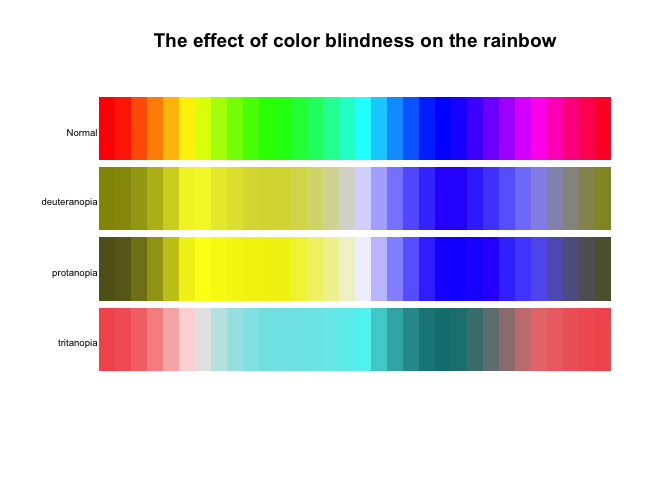<!-- -->

A related problem happens with the standard color palette used in
`ggplot2` since that color is picked to have constant chroma and
luminance thus yielding the same shade of grey when desaturated. (This
palette is no longer the default for continuous variables in `ggplot2`
after version 3.0.0)

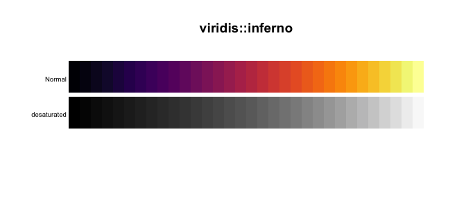<!-- -->

One of the continuous palette that satisfy this criteria is the well
known `viridis` palettes.

<!-- -->

To test if the palette you want to use will be distorted when in black
and white, use the `colorspace::desaturate()` to desaturate it.

### Color blindness

Another thing you have to take into consideration when picking a palette
is how it would be viewed by a person who is [color
blind](https://en.wikipedia.org/wiki/Color_blindness). To visualize the
effect of color blindness on our palettes we will turn to two packages.
The `dichromat` package can simulate color blindness on individual color
and then also entire palettes like so in this `rainbow` palette:

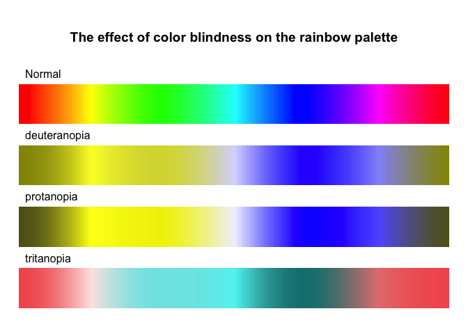<!-- -->

Another package that can provide helpful is the amazing
[colorblindr](https://github.com/clauswilke/colorblindr) package that is
able to simulate color blindness to `ggplot` objects them self.

## Honorable mentions

Due to the somehow vague notion of “color palette” have I decided to
exclude certain kinds of packages from the main gallery. [Generative
package](#generative-packages) have been discussed earlier.

### cpt-city

The amazing
[cpt-city](http://soliton.vm.bytemark.co.uk/pub/cpt-city/index.html) is
a wonderful project of creating an archive of color palettes to be used
in cartography, technical illustration and design. Due to the immense
size (7140) I have decided to refer to it instead of re-illustration
them in this repository. If any of the palettes found here are for your
liking they can be accessed in R using the following
[package](https://cran.r-project.org/web/packages/cptcity/index.html):

``` r
# CRAN version
install.packages("cptcity")
```

### sport colors

Many of the palettes in sports related palettes have a very limited
number of colors (often only 2 colors). This leads to quite low
usability outside of the special area of sports analytic.

  - [colorr](https://cran.r-project.org/web/packages/colorr/index.html)
    Color palettes for EPL, MLB, NBA, NHL, and NFL teams.

  - [beanumber/teamcolors](https://github.com/beanumber/teamcolors) An R
    package providing color palettes for pro sports teams.

### Canva palettes

The `ggthemes` package include the 150 four-color palettes from the
[canva.com](canva.com). Due to the size and limited number of colors in
the palettes these palettes will be featured on their own page and only
once.

  - [Canva colors](canva.md)

## Palettes sorted by Package (alphabetically)

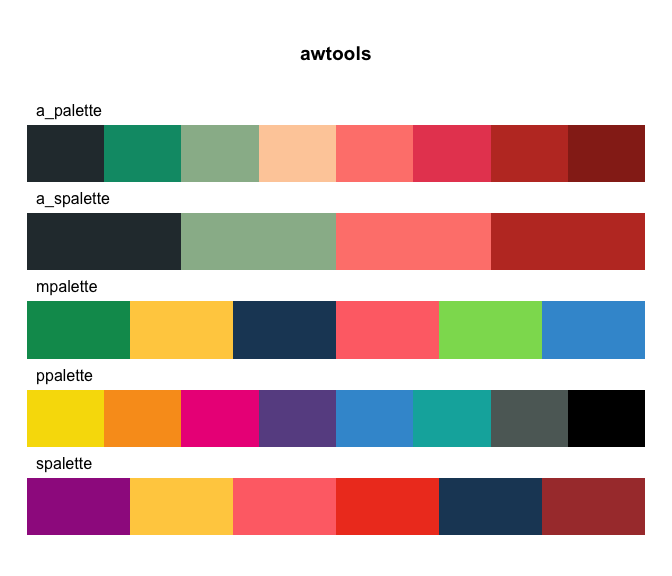<!-- -->

``` r
# Developmental version
devtools::install_github("awhstin/awtools")
```

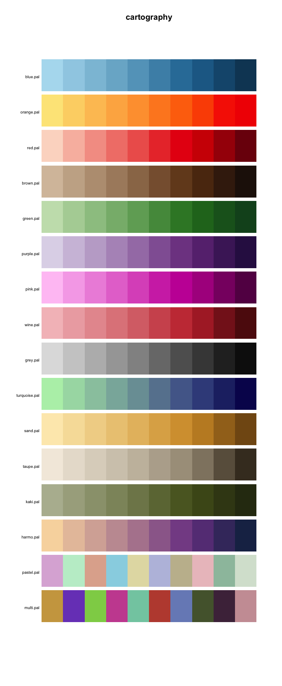<!-- -->

``` r
# Developmental version
devtools::install_github("riatelab/cartography")
# CRAN version
install.packages("cartography")
```

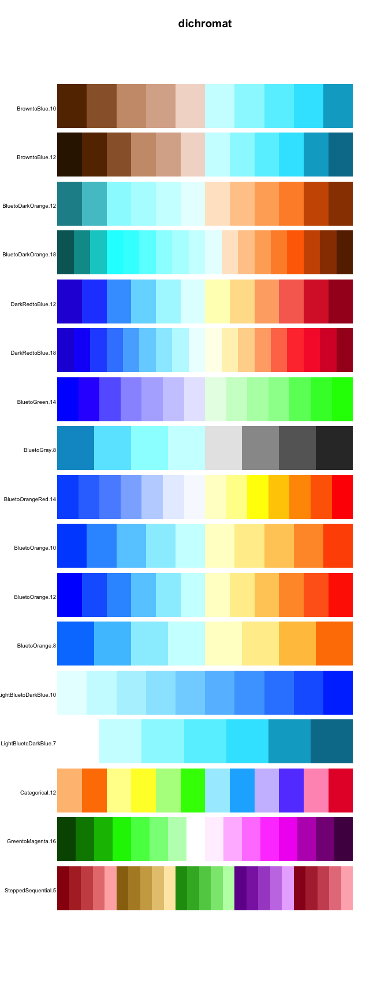<!-- -->

``` r
# CRAN version
install.packages("dichromat")
```

<!-- -->

``` r
# Developmental version
devtools::install_github("EdwinTh/dutchmasters")
```

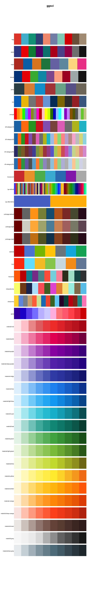<!-- -->

``` r
# Developmental version
devtools::install_github("road2stat/ggsci")
# CRAN version
install.packages("ggsci")
```

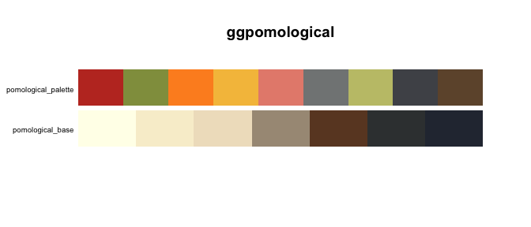<!-- -->

``` r
# Developmental version
devtools::install_github("gadenbuie/ggpomological")
```

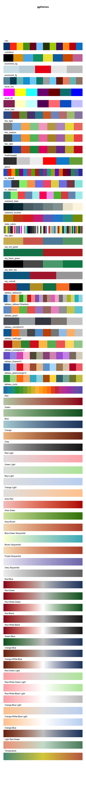<!-- -->

``` r
# Developmental version
devtools::install_github("jrnold/ggthemes")
# CRAN version
install.packages("ggthemes")
```

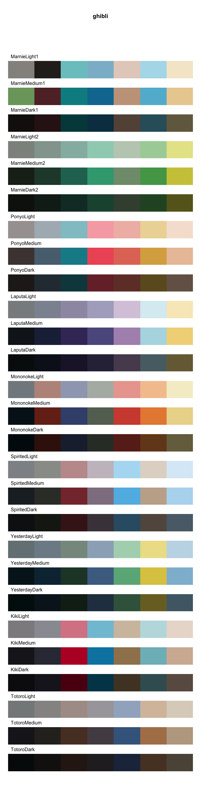<!-- -->

``` r
# Developmental version
devtools::install_github("ewenme/ghibli")
# CRAN version
install.packages("ghibli")
```

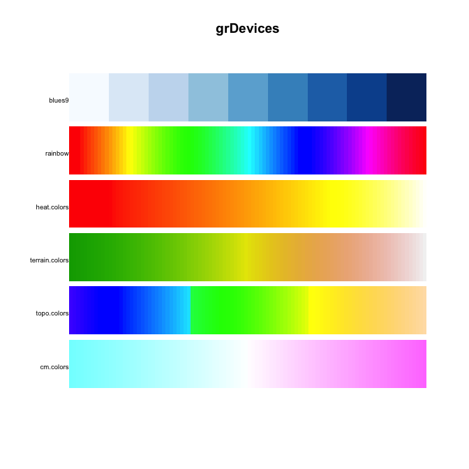<!-- -->

``` r
# CRAN version
install.packages("grDevices")
```

<!-- -->

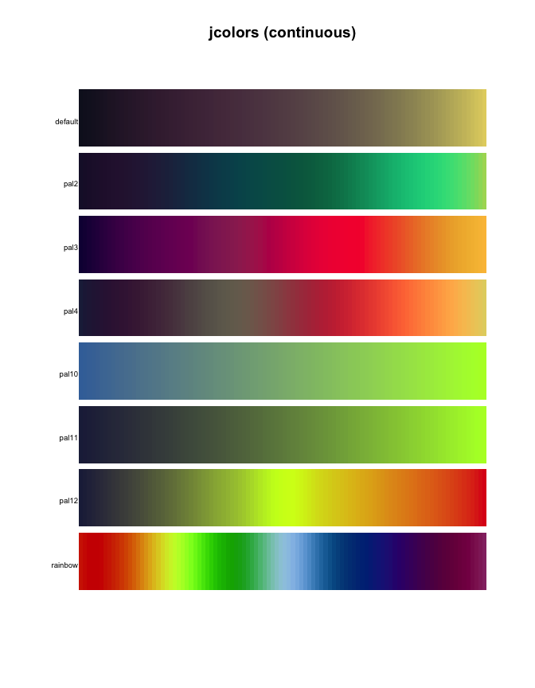<!-- -->

the `jcolors` continuous palettes are currently not available in the
`paletteer` package.

``` r
# Developmental version
devtools::install_github("jaredhuling/jcolors")
# CRAN version
install.packages("jcolors")
```

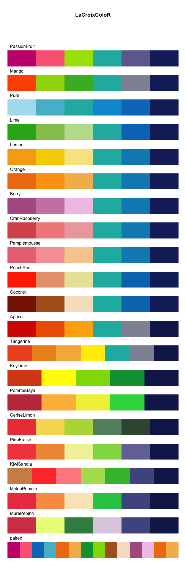<!-- -->

``` r
# Developmental version
devtools::install_github("johannesbjork/LaCroixColoR")
```

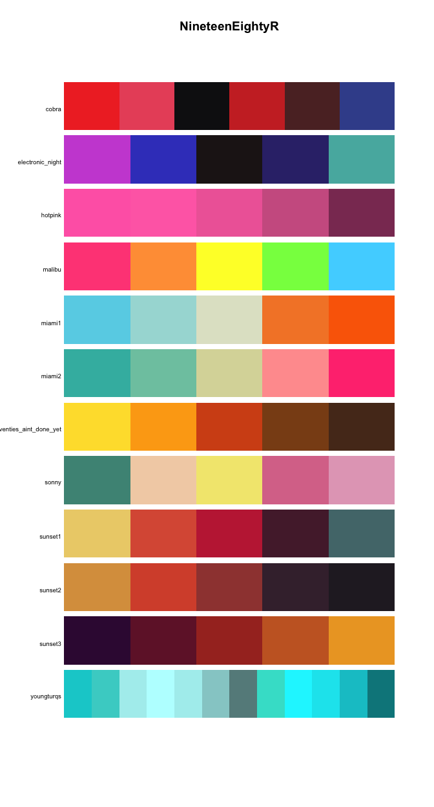<!-- -->

``` r
# Developmental version
devtools::install_github("m-clark/NineteenEightyR")
```

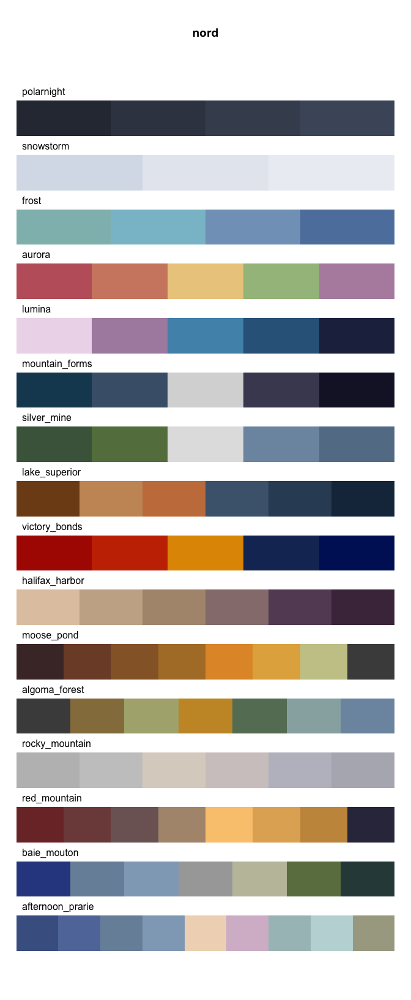<!-- -->

``` r
# Developmental version
devtools::install_github("jkaupp/nord")
# CRAN version
install.packages("nord")
```

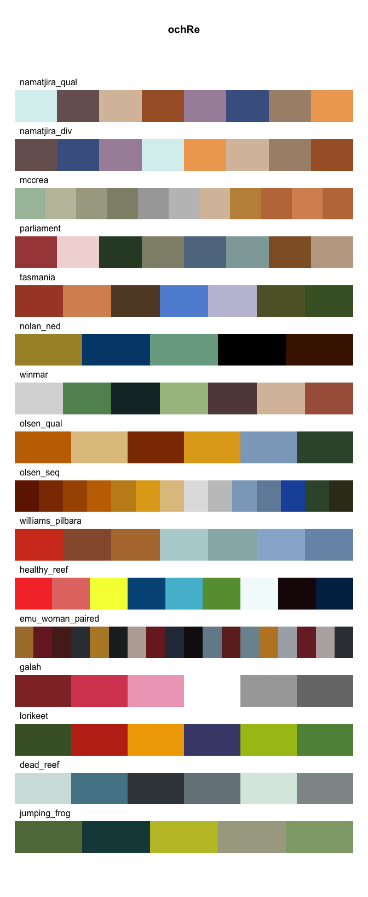<!-- -->

``` r
# Developmental version
devtools::install_github("ropenscilabs/ochRe")
# CRAN version
install.packages("ochRe")
```

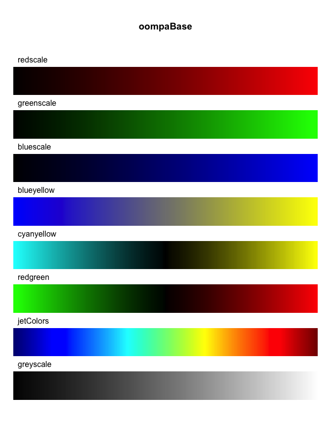<!-- -->

``` r
# CRAN version
install.packages("oompaBase")
```

<!-- -->

``` r
# Developmental version
devtools::install_github("timcdlucas/palettetown")
# CRAN version
install.packages("palettetown")
```

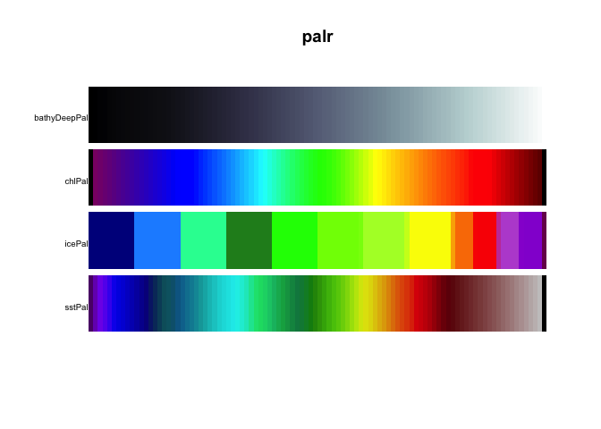<!-- -->

``` r
# Developmental version
devtools::install_github("AustralianAntarcticDivision/palr")
# CRAN version
install.packages("palr")
```

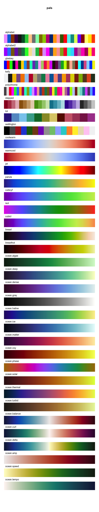<!-- -->

``` r
# Developmental version
devtools::install_github("kwstat/pals")
# CRAN version
install.packages("pals")
```

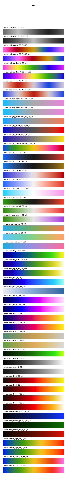<!-- -->

``` r
# Developmental version
devtools::install_github("kwstat/pals")
# CRAN version
install.packages("pals")
```

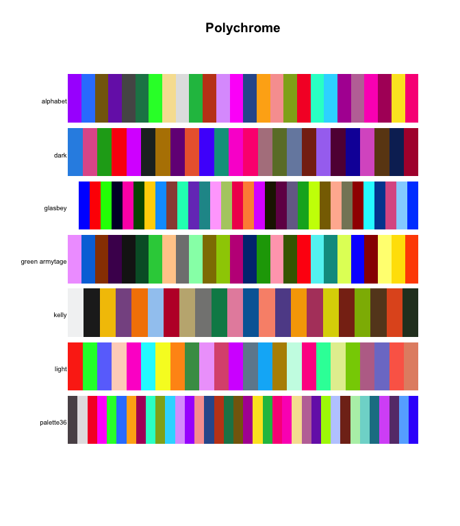<!-- -->

``` r
# CRAN version
install.packages("Polychrome")
```

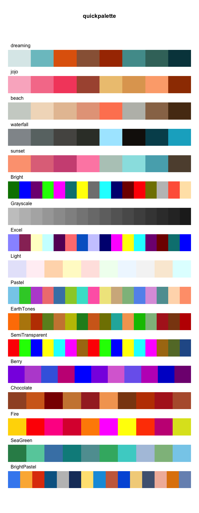<!-- -->

``` r
# Developmental version
devtools::install_github("EmilHvitfeldt/quickpalette")
```

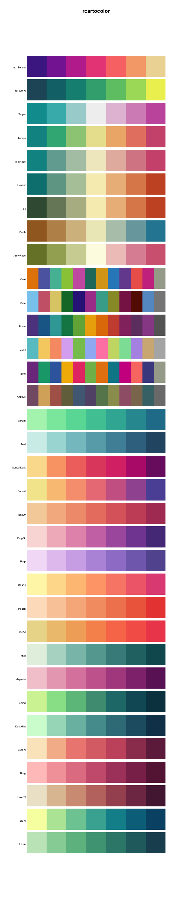<!-- -->

``` r
# Developmental version
devtools::install_github("Nowosad/rcartocolor")
# CRAN version
install.packages("rcartocolor")
```

<!-- -->

``` r
# CRAN version
install.packages("RColorBrewer")
```

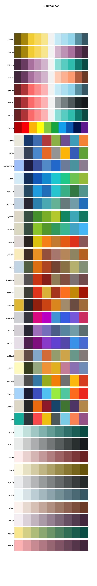<!-- -->

``` r
# CRAN version
install.packages("Redmonder")
```

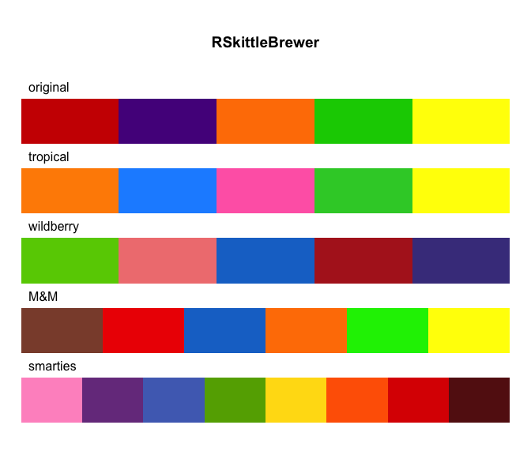<!-- -->

``` r
# Developmental version
devtools::install_github("alyssafrazee/RSkittleBrewer")
```

<!-- -->

``` r
# Developmental version
devtools::install_github("thomasp85/scico")
# CRAN version
install.packages("scico")
```

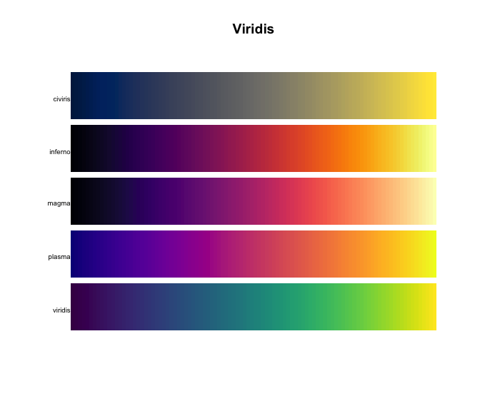<!-- -->

``` r
# Developmental version
devtools::install_github("sjmgarnier/viridis")
# CRAN version
install.packages("viridis")
```

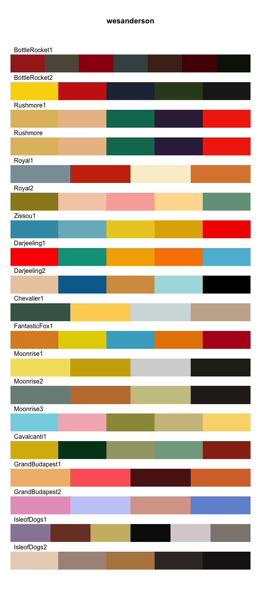<!-- -->

``` r
# Developmental version
devtools::install_github("karthik/wesanderson")
# CRAN version
install.packages("wesanderson")
```

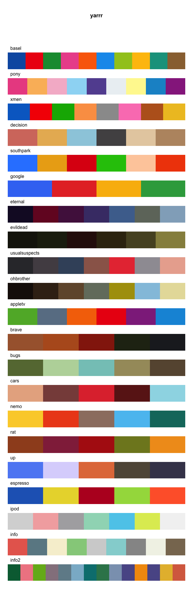<!-- -->

``` r
# Developmental version
devtools::install_github("ndphillips/yarrr")
# CRAN version
install.packages("yarrr")
```
