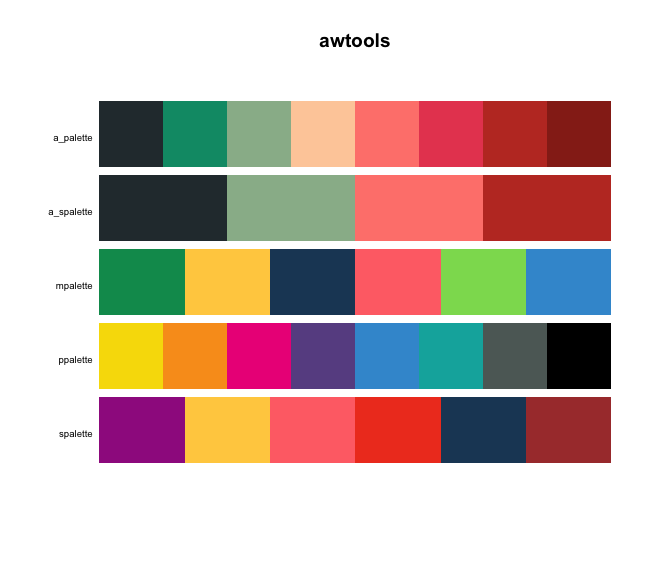
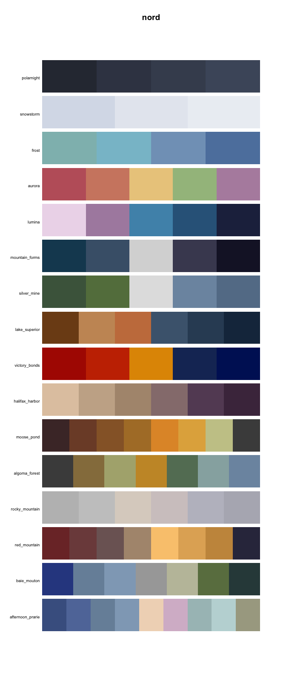
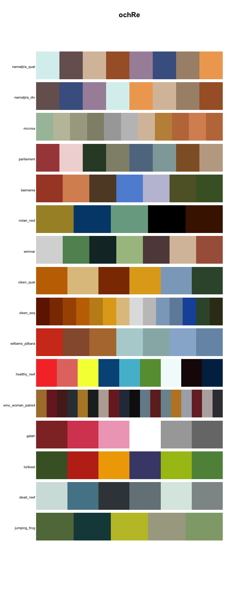
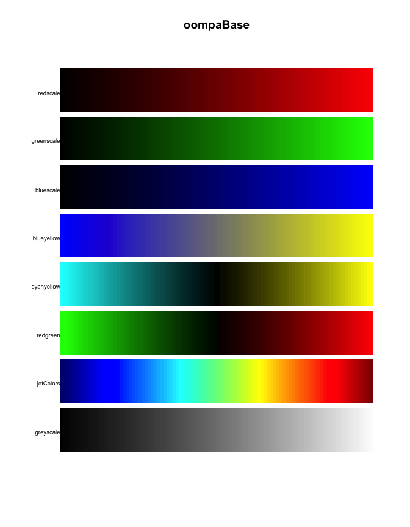
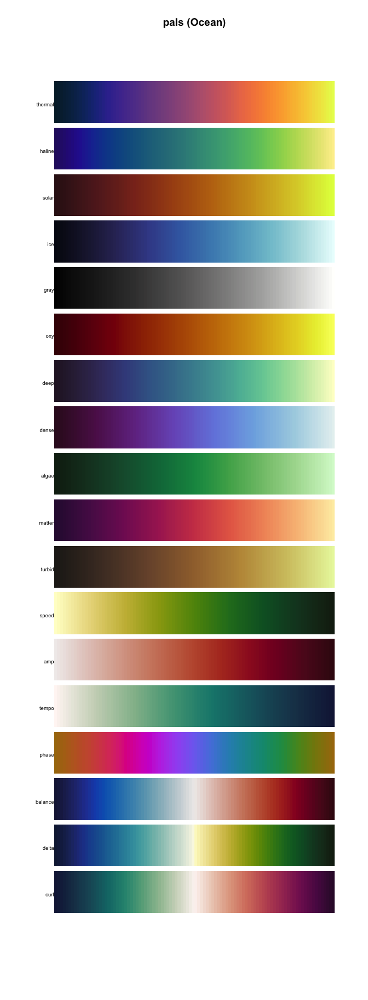
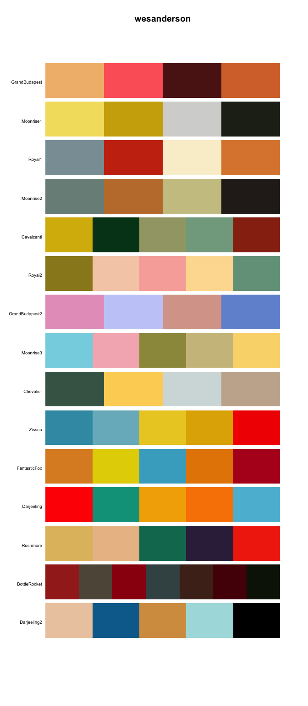
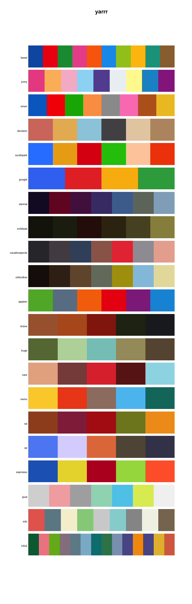

<!-- README.md is generated from README.Rmd. Please edit that file -->
Comprehensive list of color palettes in r
=========================================

The goal of this repository is to have a one stop destination for anyone looking for a color palette to use in r. If you would like to help/contribute please feel free post an issue, PR or send a email to <emilhhvitfeldt@gmail.com>.

----- **Atttention** -----
As this project is still in its early days I especially appreciate feedback on packages I have overlooked.

Further down the page is all the palettes available in the R ecosystem order alphabetically by package name. A list of palettes ordered by type can be found here [Type sorted palettes](type-sorted-palettes.md) to shorten the length of this page.

Table of Contents
=================

-   [Main page](#comprehensive-list-of-color-palettes-in-r)
-   [Blogposts and other resources](#blogposts-and-other-resources)
-   [Generative packages](#generative-packages)
-   [Honorable mentions](#honorable-mentions)
-   [Palettes sorted by Package (alphabetically)](#palettes-sorted-by-package-alphabetically)
    -   [Sequential color palettes](type-sorted-palettes.md#sequential-color-palettes)
    -   [Diverging color palettes](type-sorted-palettes.md#diverging-color-palettes)
    -   [Qualitative color palettes](type-sorted-palettes.md#qualitative-color-palettes)

Blogposts and other resources
-----------------------------

Here is a collection of material on the use and creation of color palettes in r.

-   [Creating corporate colour palettes for ggplot2](https://drsimonj.svbtle.com/creating-corporate-colour-palettes-for-ggplot2)
-   [Make your own color palettes with paletti](https://edwinth.github.io/blog/paletti/)
-   [How to create a color palette in R with more than 15 colors with ggplot2](https://github.com/duttashi/visualize/issues/19)
-   [Generating a Custom Color Palette Function in R](https://quantdev.ssri.psu.edu/tutorials/generating-custom-color-palette-function-r)
-   [How to build a color palette from any image with R and k-means algo](http://www.milanor.net/blog/build-color-palette-from-image-with-paletter/)

Generative packages
-------------------

The purpose of this project is to showcase the palettes already available in R (packages). However sometimes you have to resort to make one yourself. When that is the case the following packages aides in creating.

-   [AndreaCirilloAC/paletter](https://github.com/AndreaCirilloAC/paletter)
-   [jolars/qualpalr](https://github.com/jolars/qualpalr)
-   [ronammar/randomcoloR](https://github.com/ronammar/randomcoloR)
-   [johnbaums/hues](https://github.com/johnbaums/hues)
-   [ColorPalette](https://cran.r-project.org/web/packages/ColorPalette/index.html)
-   [oaColors](https://cran.rstudio.com/web/packages/oaColors/index.html)
-   [earthtones](https://cran.r-project.org/web/packages/earthtones/index.html)
-   [leeper/colourlovers](https://github.com/leeper/colourlovers)

When creating color palettes certain website have also provided valuable

-   [paletton](http://paletton.com/)
-   [Data color picker](https://learnui.design/tools/data-color-picker.html)
-   [i want hue](http://tools.medialab.sciences-po.fr/iwanthue/)

Honorable mentions
------------------

Due to the somehow vague notion of "color palette" have I decided to exclude certain kinds of packages from the main gallery. [Generative package](#generative-packages) have been discussed earlier.

### sport colors

Many of the palettes in sports related palettes have a very limited number of colors (often only 2 colors). This leads to quite low usability outside of the special area of sports analytic.

-   [colorr](https://cran.r-project.org/web/packages/colorr/index.html) Color palettes for EPL, MLB, NBA, NHL, and NFL teams.

-   [beanumber/teamcolors](https://github.com/beanumber/teamcolors) An R package providing color palettes for pro sports teams.

Palettes sorted by Package (alphabetically)
-------------------------------------------



``` r
# Developmental version
devtools::install_github("awhstin/awtools")
```


``` r
# Developmental version
devtools::install_github("marcosci/cividis")
```


``` r
# Developmental version
devtools::install_github("EdwinTh/dutchmasters")
```


``` r
# Developmental version
devtools::install_github("road2stat/ggsci")
# CRAN version
install.packages("ggsci")
```


``` r
# Developmental version
devtools::install_github("ewenme/ghibli")
# CRAN version
install.packages("ghibli")
```


``` r
# CRAN version
install.packages("grDevices")
```



``` r
# Developmental version
devtools::install_github("jkaupp/nord")
# CRAN version
install.packages("nord")
```



``` r
# Developmental version
devtools::install_github("ropenscilabs/ochRe")
# CRAN version
install.packages("ochRe")
```



``` r
# CRAN version
install.packages("oompaBase")
```


``` r
# Developmental version
devtools::install_github("timcdlucas/palettetown")
# CRAN version
install.packages("palettetown")
```


``` r
# Developmental version
devtools::install_github("kwstat/pals")
# CRAN version
install.packages("pals")
```


``` r
# Developmental version
devtools::install_github("kwstat/pals")
# CRAN version
install.packages("pals")
```


``` r
# Developmental version
devtools::install_github("kwstat/pals")
# CRAN version
install.packages("pals")
```



``` r
# Developmental version
devtools::install_github("kwstat/pals")
# CRAN version
install.packages("pals")
```


``` r
# Developmental version
devtools::install_github("kwstat/pals")
# CRAN version
install.packages("pals")
```


``` r
# Developmental version
devtools::install_github("kwstat/pals")
# CRAN version
install.packages("pals")
```


``` r
# CRAN version
install.packages("Polychrome")
```


``` r
# Developmental version
devtools::install_github("Nowosad/rcartocolor")
# CRAN version
install.packages("rcartocolor")
```


``` r
# CRAN version
install.packages("RColorBrewer")
```


``` r
# CRAN version
install.packages("Redmonder")
```


``` r
# Developmental version
devtools::install_github("alyssafrazee/RSkittleBrewer")
```


``` r
# Developmental version
devtools::install_github("sjmgarnier/viridis")
# CRAN version
install.packages("viridis")
```



``` r
# Developmental version
devtools::install_github("karthik/wesanderson")
# CRAN version
install.packages("wesanderson")
```



``` r
# Developmental version
devtools::install_github("ndphillips/yarrr")
# CRAN version
install.packages("yarrr")
```
