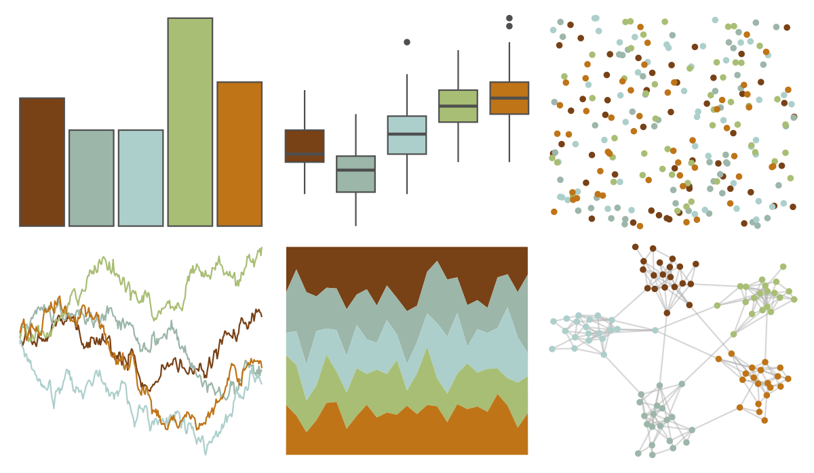

# ButterflyColors - anteos_clorinde 

::: columns
::: {.column width="50%"}

**Github**

[junqueiragaabi/ButterflyColors](https://github.com/junqueiragaabi/ButterflyColors)
:::

::: {.column width="50%"}

**CRAN**

Not on CRAN
:::
:::

<hr> 

Use with [paletteer](https://emilhvitfeldt.github.io/paletteer/) package:

```r
library(paletteer)
paletteer_d("ButterflyColors::anteos_clorinde")
```

Use raw:

```r
c("#784116FF", "#9CB6A9FF", "#ACCFCBFF", "#A8BE74FF", "#BF7417FF")
``` 

 

<br>

# Related Palettes

<div class="list" style="display: grid; grid-template-columns: auto auto auto;"> <figure class="figure">
<a href="../../amerika/Dem_Ind_Rep3/"> </a>
</figure> <figure class="figure">
<a href="../../Manu/Titipounamu/"> </a>
</figure> <figure class="figure">
<a href="../../fishualize/Oncorhynchus_mykiss/"> </a>
</figure> <figure class="figure">
<a href="../../IslamicArt/fes/"> </a>
</figure> <figure class="figure">
<a href="../../poisonfrogs/Hhobbsi/"> </a>
</figure> <figure class="figure">
<a href="../../ggthemes/excel_Wisp/"> </a>
</figure> <figure class="figure">
<a href="../../trekcolors/ferengi/"> </a>
</figure> <figure class="figure">
<a href="../../rcartocolor/Fall/"> </a>
</figure> <figure class="figure">
<a href="../../rcartocolor/Geyser/"> </a>
</figure> <figure class="figure">
<a href="../../Redmonder/qMSOOr/"> </a>
</figure> <figure class="figure">
<a href="../../nationalparkcolors/BryceCanyon/"> </a>
</figure> <figure class="figure">
<a href="../../lisa/PaulKlee/"> </a>
</figure> 
</div>
