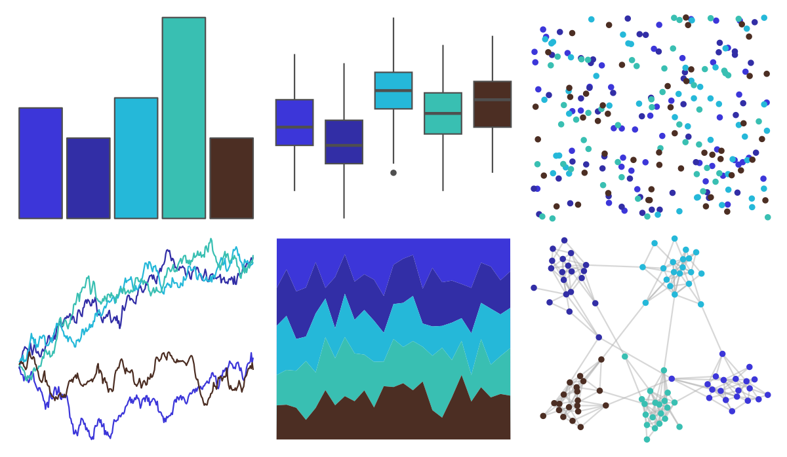

# ButterflyColors - archaeoprepona_demophon_thalpius 

::: columns
::: {.column width="50%"}

**Github**

[junqueiragaabi/ButterflyColors](https://github.com/junqueiragaabi/ButterflyColors)
:::

::: {.column width="50%"}

**CRAN**

Not on CRAN
:::
:::

<hr> 

Use with [paletteer](https://emilhvitfeldt.github.io/paletteer/) package:

```r
library(paletteer)
paletteer_d("ButterflyColors::archaeoprepona_demophon_thalpius")
```

Use raw:

```r
c("#3C36D9FF", "#322EA6FF", "#25B8D9FF", "#39BFB2FF", "#4C2E23FF")
``` 

 

<br>

# Related Palettes

<div class="list" style="display: grid; grid-template-columns: auto auto auto;"> <figure class="figure">
<a href="../../amerika/Dem_Ind_Rep3/"> </a>
</figure> <figure class="figure">
<a href="../../vapoRwave/jazzCup/"> </a>
</figure> <figure class="figure">
<a href="../../vapeplot/jazzcup/"> </a>
</figure> <figure class="figure">
<a href="../../lisa/GeorgiaOKeeffe/"> </a>
</figure> <figure class="figure">
<a href="../../rtist/okeeffe/"> </a>
</figure> <figure class="figure">
<a href="../../beyonce/X21/"> </a>
</figure> <figure class="figure">
<a href="../../MetBrewer/Pissaro/"> </a>
</figure> <figure class="figure">
<a href="../../fishualize/Chlorurus_microrhinos/"> </a>
</figure> <figure class="figure">
<a href="../../MetBrewer/Hokusai2/"> </a>
</figure> <figure class="figure">
<a href="../../PrettyCols/Ocean/"> </a>
</figure> <figure class="figure">
<a href="../../MoMAColors/Doughton/"> </a>
</figure> <figure class="figure">
<a href="../../PrettyCols/Sea/"> </a>
</figure> 
</div>
