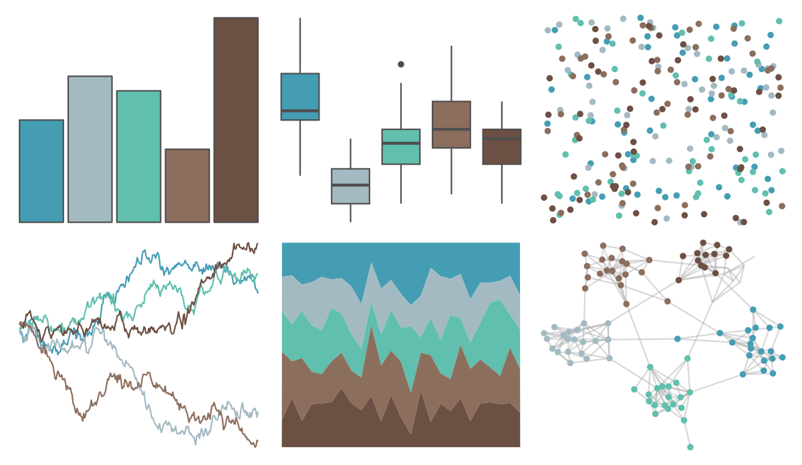

# ButterflyColors - astraptes_fulgerator 

::: columns
::: {.column width="50%"}

**Github**

[junqueiragaabi/ButterflyColors](https://github.com/junqueiragaabi/ButterflyColors)
:::

::: {.column width="50%"}

**CRAN**

Not on CRAN
:::
:::

<hr> 

Use with [paletteer](https://emilhvitfeldt.github.io/paletteer/) package:

```r
library(paletteer)
paletteer_d("ButterflyColors::astraptes_fulgerator")
```

Use raw:

```r
c("#449DB3FF", "#A3BAC2FF", "#60BFAEFF", "#8C6E5DFF", "#6C5043FF")
``` 

 

<br>

# Related Palettes

<div class="list" style="display: grid; grid-template-columns: auto auto auto;"> <figure class="figure">
<a href="../../awtools/a_palette/"> </a>
</figure> <figure class="figure">
<a href="../../ButterflyColors/hamadryas_feronia/"> </a>
</figure> <figure class="figure">
<a href="../../ButterflyColors/hamadryas_feronia/"> </a>
</figure> <figure class="figure">
<a href="../../ButterflyColors/pseudolycaena_marsyas/"> </a>
</figure> <figure class="figure">
<a href="../../colRoz/shark_bay/"> </a>
</figure> <figure class="figure">
<a href="../../MetBrewer/Monet/"> </a>
</figure> <figure class="figure">
<a href="../../lisa/SalvadorDali_1/"> </a>
</figure> <figure class="figure">
<a href="../../calecopal/lupinus/"> </a>
</figure> <figure class="figure">
<a href="../../ggthemes/excel_View/"> </a>
</figure> <figure class="figure">
<a href="../../calecopal/collinsia/"> </a>
</figure> <figure class="figure">
<a href="../../fishualize/Alosa_fallax/"> </a>
</figure> <figure class="figure">
<a href="../../ggthemes/excel_Feathered/"> </a>
</figure> 
</div>
