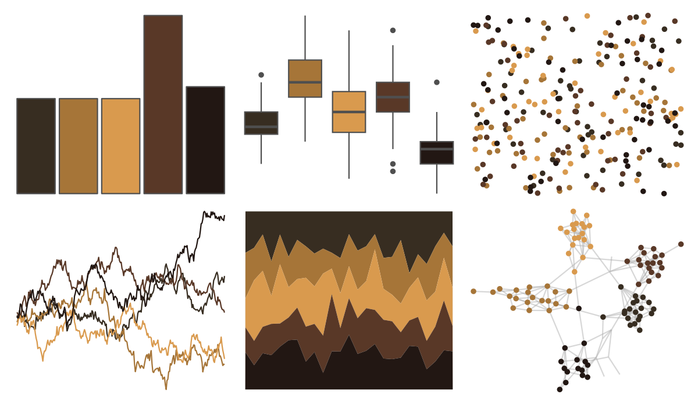

# ButterflyColors - battus_polydamas 

::: columns
::: {.column width="50%"}

**Github**

[junqueiragaabi/ButterflyColors](https://github.com/junqueiragaabi/ButterflyColors)
:::

::: {.column width="50%"}

**CRAN**

Not on CRAN
:::
:::

<hr> 

Use with [paletteer](https://emilhvitfeldt.github.io/paletteer/) package:

```r
library(paletteer)
paletteer_d("ButterflyColors::battus_polydamas")
```

Use raw:

```r
c("#372D21FF", "#A67538FF", "#D99A4EFF", "#593827FF", "#221713FF")
``` 

 

<br>

# Related Palettes

<div class="list" style="display: grid; grid-template-columns: auto auto auto;"> <figure class="figure">
<a href="../../awtools/a_palette/"> </a>
</figure> <figure class="figure">
<a href="../../ButterflyColors/hamadryas_feronia/"> </a>
</figure> <figure class="figure">
<a href="../../ButterflyColors/hamadryas_feronia/"> </a>
</figure> <figure class="figure">
<a href="../../beyonce/X42/"> </a>
</figure> <figure class="figure">
<a href="../../beyonce/X102/"> </a>
</figure> <figure class="figure">
<a href="../../DresdenColor/turncoat/"> </a>
</figure> <figure class="figure">
<a href="../../lisa/DiegoVelazquez/"> </a>
</figure> <figure class="figure">
<a href="../../MetBrewer/Gauguin/"> </a>
</figure> <figure class="figure">
<a href="../../MetBrewer/Nattier/"> </a>
</figure> <figure class="figure">
<a href="../../ButterflyColors/smyrna_blomfidiana/"> </a>
</figure> <figure class="figure">
<a href="../../colRoz/v_pilbarensis/"> </a>
</figure> <figure class="figure">
<a href="../../colRoz/a_conica/"> </a>
</figure> 
</div>
