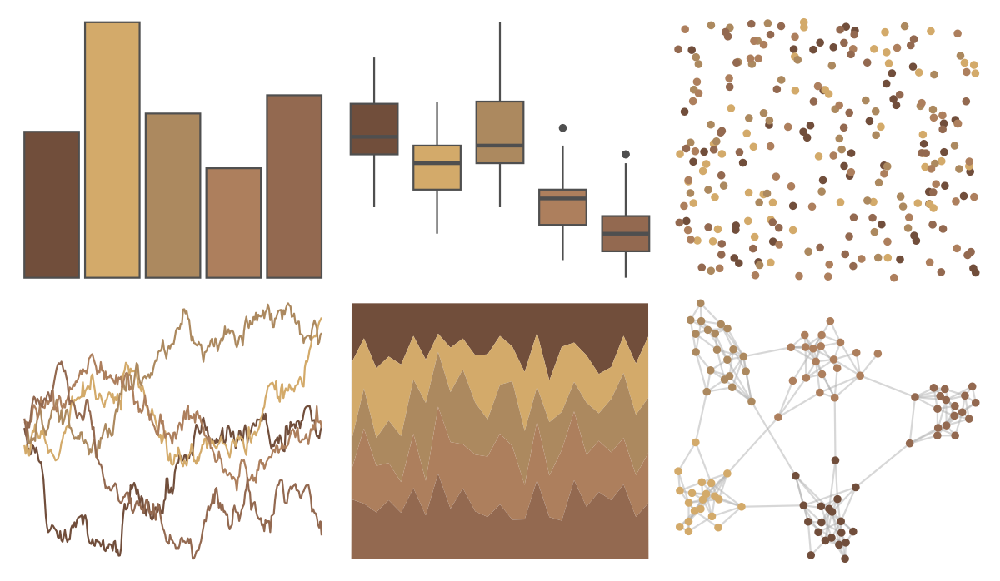

# ButterflyColors - brassolis_sophorae 

::: columns
::: {.column width="50%"}

**Github**

[junqueiragaabi/ButterflyColors](https://github.com/junqueiragaabi/ButterflyColors)
:::

::: {.column width="50%"}

**CRAN**

Not on CRAN
:::
:::

<hr> 

Use with [paletteer](https://emilhvitfeldt.github.io/paletteer/) package:

```r
library(paletteer)
paletteer_d("ButterflyColors::brassolis_sophorae")
```

Use raw:

```r
c("#714E3BFF", "#D3AA6AFF", "#AC895FFF", "#AD7F5DFF", "#936950FF")
``` 

 

<br>

# Related Palettes

<div class="list" style="display: grid; grid-template-columns: auto auto auto;"> <figure class="figure">
<a href="../../amerika/Dem_Ind_Rep3/"> </a>
</figure> <figure class="figure">
<a href="../../fishualize/Petromyzon_marinus/"> </a>
</figure> <figure class="figure">
<a href="../../vangogh/Shoes/"> </a>
</figure> <figure class="figure">
<a href="../../ButterflyColors/hylephila_phyleus/"> </a>
</figure> <figure class="figure">
<a href="../../ggthemes/excel_Red/"> </a>
</figure> <figure class="figure">
<a href="../../vangogh/SunflowersLondon/"> </a>
</figure> <figure class="figure">
<a href="../../colRoz/thylacine/"> </a>
</figure> <figure class="figure">
<a href="../../calecopal/conifer/"> </a>
</figure> <figure class="figure">
<a href="../../ggthemes/excel_Yellow_Orange/"> </a>
</figure> <figure class="figure">
<a href="../../ButterflyColors/junonia_evarete/"> </a>
</figure> <figure class="figure">
<a href="../../calecopal/dudleya/"> </a>
</figure> <figure class="figure">
<a href="../../Rdune/arrakis/"> </a>
</figure> 
</div>
