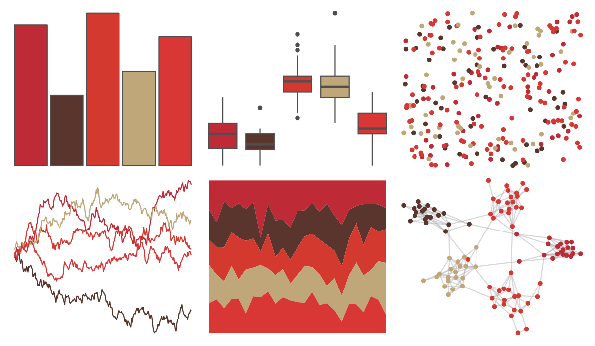

# ButterflyColors - catagramma_pygas 

::: columns
::: {.column width="50%"}

**Github**

[junqueiragaabi/ButterflyColors](https://github.com/junqueiragaabi/ButterflyColors)
:::

::: {.column width="50%"}

**CRAN**

Not on CRAN
:::
:::

<hr> 

Use with [paletteer](https://emilhvitfeldt.github.io/paletteer/) package:

```r
library(paletteer)
paletteer_d("ButterflyColors::catagramma_pygas")
```

Use raw:

```r
c("#BF2A37FF", "#59352DFF", "#D3392FFF", "#BFA77AFF", "#D93636FF")
``` 

 

<br>

# Related Palettes

<div class="list" style="display: grid; grid-template-columns: auto auto auto;"> <figure class="figure">
<a href="../../amerika/Dem_Ind_Rep3/"> </a>
</figure> <figure class="figure">
<a href="../../fishualize/Epinephelus_striatus/"> </a>
</figure> <figure class="figure">
<a href="../../ggthemes/excel_Orange_Red/"> </a>
</figure> <figure class="figure">
<a href="../../ggthemes/excel_Wood_Type/"> </a>
</figure> <figure class="figure">
<a href="../../NatParksPalettes/BryceCanyon/"> </a>
</figure> <figure class="figure">
<a href="../../beyonce/X70/"> </a>
</figure> <figure class="figure">
<a href="../../ButterflyColors/smyrna_blomfidiana/"> </a>
</figure> <figure class="figure">
<a href="../../ButterflyColors/danaus_erippus/"> </a>
</figure> <figure class="figure">
<a href="../../lisa/MaxBeckmann/"> </a>
</figure> <figure class="figure">
<a href="../../lisa/BarnettNewman/"> </a>
</figure> <figure class="figure">
<a href="../../NineteenEightyR/sunset2/"> </a>
</figure> <figure class="figure">
<a href="../../beyonce/X69/"> </a>
</figure> 
</div>
