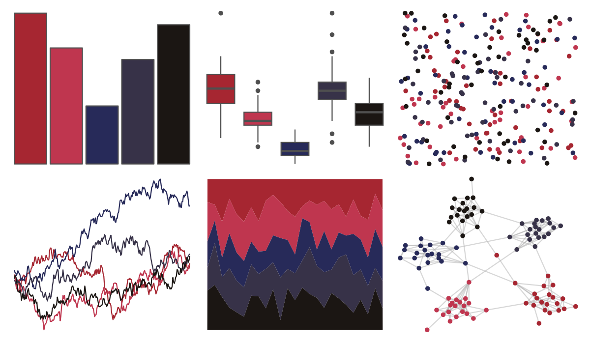

# ButterflyColors - chorinea_licursis 

::: columns
::: {.column width="50%"}

**Github**

[junqueiragaabi/ButterflyColors](https://github.com/junqueiragaabi/ButterflyColors)
:::

::: {.column width="50%"}

**CRAN**

Not on CRAN
:::
:::

<hr> 

Use with [paletteer](https://emilhvitfeldt.github.io/paletteer/) package:

```r
library(paletteer)
paletteer_d("ButterflyColors::chorinea_licursis")
```

Use raw:

```r
c("#A62631FF", "#BF364FFF", "#272A59FF", "#373248FF", "#1B1613FF")
``` 

 

<br>

# Related Palettes

<div class="list" style="display: grid; grid-template-columns: auto auto auto;"> <figure class="figure">
<a href="../../awtools/a_palette/"> </a>
</figure> <figure class="figure">
<a href="../../ButterflyColors/hamadryas_feronia/"> </a>
</figure> <figure class="figure">
<a href="../../ButterflyColors/hamadryas_feronia/"> </a>
</figure> <figure class="figure">
<a href="../../beyonce/X4/"> </a>
</figure> <figure class="figure">
<a href="../../ButterflyColors/fountainea_ryphea/"> </a>
</figure> <figure class="figure">
<a href="../../nbapalettes/blazers_city2/"> </a>
</figure> <figure class="figure">
<a href="../../NineteenEightyR/cobra/"> </a>
</figure> <figure class="figure">
<a href="../../futurevisions/trappest/"> </a>
</figure> <figure class="figure">
<a href="../../ghibli/KikiDark/"> </a>
</figure> <figure class="figure">
<a href="../../beyonce/X14/"> </a>
</figure> <figure class="figure">
<a href="../../wesanderson/BottleRocket1/"> </a>
</figure> <figure class="figure">
<a href="../../beyonce/X91/"> </a>
</figure> 
</div>
