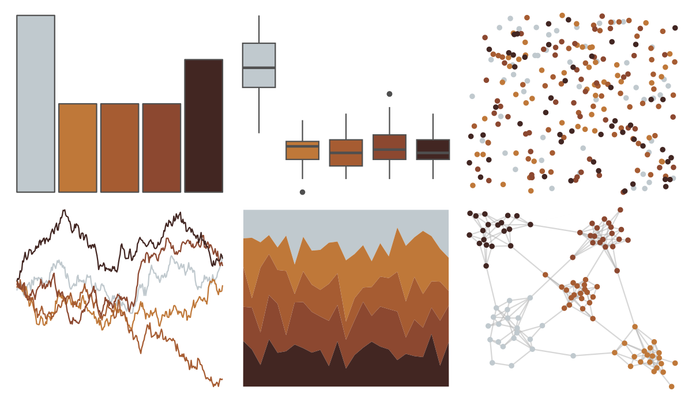

# ButterflyColors - danaus_eresimus 

::: columns
::: {.column width="50%"}

**Github**

[junqueiragaabi/ButterflyColors](https://github.com/junqueiragaabi/ButterflyColors)
:::

::: {.column width="50%"}

**CRAN**

Not on CRAN
:::
:::

<hr> 

Use with [paletteer](https://emilhvitfeldt.github.io/paletteer/) package:

```r
library(paletteer)
paletteer_d("ButterflyColors::danaus_eresimus")
```

Use raw:

```r
c("#C0C9CEFF", "#BF7839FF", "#A65C32FF", "#8C4830FF", "#422622FF")
``` 

 

<br>

# Related Palettes

<div class="list" style="display: grid; grid-template-columns: auto auto auto;"> <figure class="figure">
<a href="../../amerika/Dem_Ind_Rep3/"> </a>
</figure> <figure class="figure">
<a href="../../ButterflyColors/synargis_calyce/"> </a>
</figure> <figure class="figure">
<a href="../../tayloRswift/midnightsBloodMoon/"> </a>
</figure> <figure class="figure">
<a href="../../soilpalettes/alaquod/"> </a>
</figure> <figure class="figure">
<a href="../../colRoz/e_kingii/"> </a>
</figure> <figure class="figure">
<a href="../../NatParksPalettes/WindCave/"> </a>
</figure> <figure class="figure">
<a href="../../dutchmasters/anatomy/"> </a>
</figure> <figure class="figure">
<a href="../../MoMAColors/Clay/"> </a>
</figure> <figure class="figure">
<a href="../../ButterflyColors/historis_acheronta/"> </a>
</figure> <figure class="figure">
<a href="../../rcartocolor/BrwnYl/"> </a>
</figure> <figure class="figure">
<a href="../../fishualize/Semicossyphus_pulcher/"> </a>
</figure> <figure class="figure">
<a href="../../beyonce/X12/"> </a>
</figure> 
</div>
