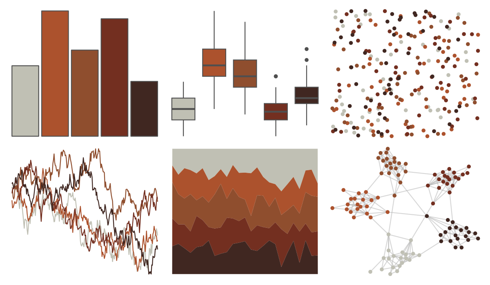

# ButterflyColors - danaus_erippus 

::: columns
::: {.column width="50%"}

**Github**

[junqueiragaabi/ButterflyColors](https://github.com/junqueiragaabi/ButterflyColors)
:::

::: {.column width="50%"}

**CRAN**

Not on CRAN
:::
:::

<hr> 

Use with [paletteer](https://emilhvitfeldt.github.io/paletteer/) package:

```r
library(paletteer)
paletteer_d("ButterflyColors::danaus_erippus")
```

Use raw:

```r
c("#C0C0B4FF", "#AC522DFF", "#8F4E2EFF", "#732F20FF", "#402721FF")
``` 

 

<br>

# Related Palettes

<div class="list" style="display: grid; grid-template-columns: auto auto auto;"> <figure class="figure">
<a href="../../amerika/Dem_Ind_Rep3/"> </a>
</figure> <figure class="figure">
<a href="../../ButterflyColors/historis_acheronta/"> </a>
</figure> <figure class="figure">
<a href="../../lisa/BarnettNewman/"> </a>
</figure> <figure class="figure">
<a href="../../werpals/firefly/"> </a>
</figure> <figure class="figure">
<a href="../../ButterflyColors/smyrna_blomfidiana/"> </a>
</figure> <figure class="figure">
<a href="../../lisa/DiegoVelazquez/"> </a>
</figure> <figure class="figure">
<a href="../../dutchmasters/anatomy/"> </a>
</figure> <figure class="figure">
<a href="../../ButterflyColors/lycorea_hallia/"> </a>
</figure> <figure class="figure">
<a href="../../DresdenColor/turncoat/"> </a>
</figure> <figure class="figure">
<a href="../../lisa/MaxBeckmann/"> </a>
</figure> <figure class="figure">
<a href="../../beyonce/X103/"> </a>
</figure> <figure class="figure">
<a href="../../ButterflyColors/synargis_calyce/"> </a>
</figure> 
</div>
