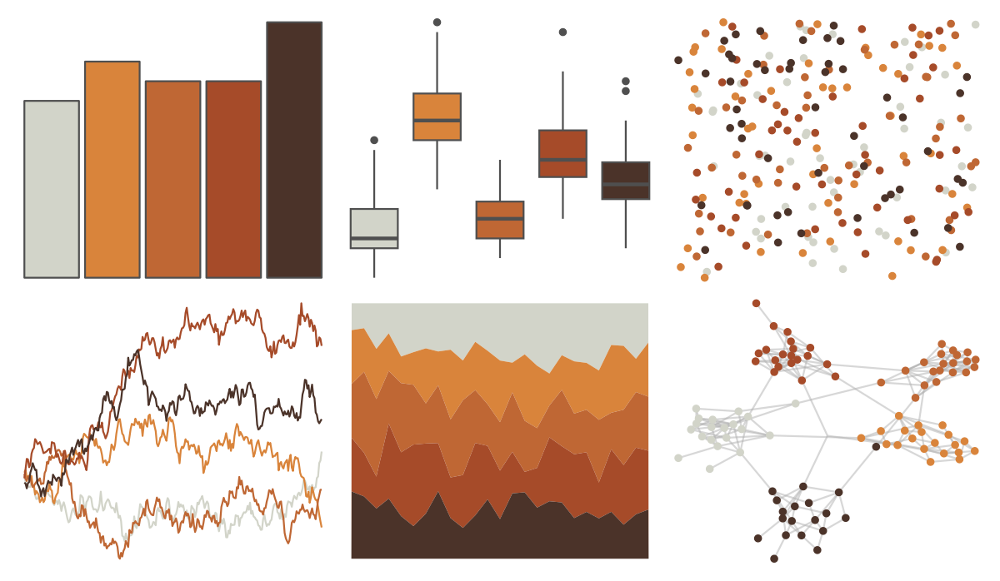

# ButterflyColors - danaus_gilippus 

::: columns
::: {.column width="50%"}

**Github**

[junqueiragaabi/ButterflyColors](https://github.com/junqueiragaabi/ButterflyColors)
:::

::: {.column width="50%"}

**CRAN**

Not on CRAN
:::
:::

<hr> 

Use with [paletteer](https://emilhvitfeldt.github.io/paletteer/) package:

```r
library(paletteer)
paletteer_d("ButterflyColors::danaus_gilippus")
```

Use raw:

```r
c("#D2D4C9FF", "#D9843BFF", "#BF6734FF", "#A64B29FF", "#4B3329FF")
``` 

 

<br>

# Related Palettes

<div class="list" style="display: grid; grid-template-columns: auto auto auto;"> <figure class="figure">
<a href="../../amerika/Dem_Ind_Rep3/"> </a>
</figure> <figure class="figure">
<a href="../../ButterflyColors/lycorea_hallia/"> </a>
</figure> <figure class="figure">
<a href="../../DresdenColor/graveperil/"> </a>
</figure> <figure class="figure">
<a href="../../ButterflyColors/historis_acheronta/"> </a>
</figure> <figure class="figure">
<a href="../../ButterflyColors/synargis_calyce/"> </a>
</figure> <figure class="figure">
<a href="../../Redmonder/qMSOYlOr/"> </a>
</figure> <figure class="figure">
<a href="../../ButterflyColors/danaus_erippus/"> </a>
</figure> <figure class="figure">
<a href="../../nord/moose_pond/"> </a>
</figure> <figure class="figure">
<a href="../../calecopal/dudleya/"> </a>
</figure> <figure class="figure">
<a href="../../DresdenColor/sidejobs/"> </a>
</figure> <figure class="figure">
<a href="../../fishualize/Pterois_volitans/"> </a>
</figure> <figure class="figure">
<a href="../../Rdune/arrakis/"> </a>
</figure> 
</div>
