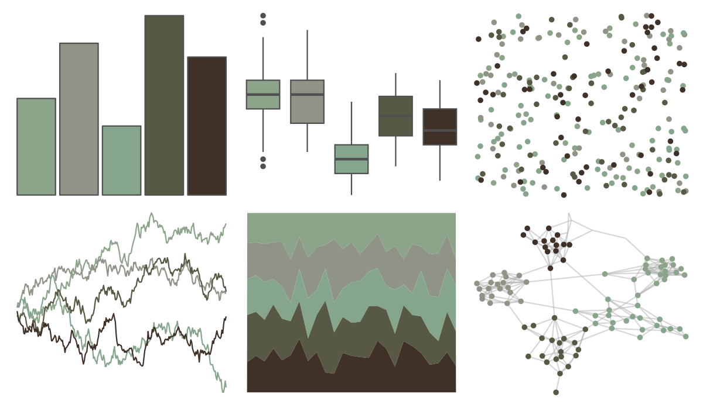

# ButterflyColors - dynamine_postverta 

::: columns
::: {.column width="50%"}

**Github**

[junqueiragaabi/ButterflyColors](https://github.com/junqueiragaabi/ButterflyColors)
:::

::: {.column width="50%"}

**CRAN**

Not on CRAN
:::
:::

<hr> 

Use with [paletteer](https://emilhvitfeldt.github.io/paletteer/) package:

```r
library(paletteer)
paletteer_d("ButterflyColors::dynamine_postverta")
```

Use raw:

```r
c("#8CA48AFF", "#909486FF", "#85A68DFF", "#575945FF", "#403128FF")
``` 

 

<br>

# Related Palettes

<div class="list" style="display: grid; grid-template-columns: auto auto auto;"> <figure class="figure">
<a href="../../awtools/a_palette/"> </a>
</figure> <figure class="figure">
<a href="../../ButterflyColors/hamadryas_feronia/"> </a>
</figure> <figure class="figure">
<a href="../../ButterflyColors/hamadryas_feronia/"> </a>
</figure> <figure class="figure">
<a href="../../beyonce/X3/"> </a>
</figure> <figure class="figure">
<a href="../../fishualize/Lile_piquitinga/"> </a>
</figure> <figure class="figure">
<a href="../../MexBrewer/Taurus2/"> </a>
</figure> <figure class="figure">
<a href="../../colRoz/shark_bay/"> </a>
</figure> <figure class="figure">
<a href="../../colRoz/thylacine/"> </a>
</figure> <figure class="figure">
<a href="../../MexBrewer/Concha/"> </a>
</figure> <figure class="figure">
<a href="../../calecopal/redwood1/"> </a>
</figure> <figure class="figure">
<a href="../../IslamicArt/fes2/"> </a>
</figure> <figure class="figure">
<a href="../../fishualize/Petromyzon_marinus/"> </a>
</figure> 
</div>
