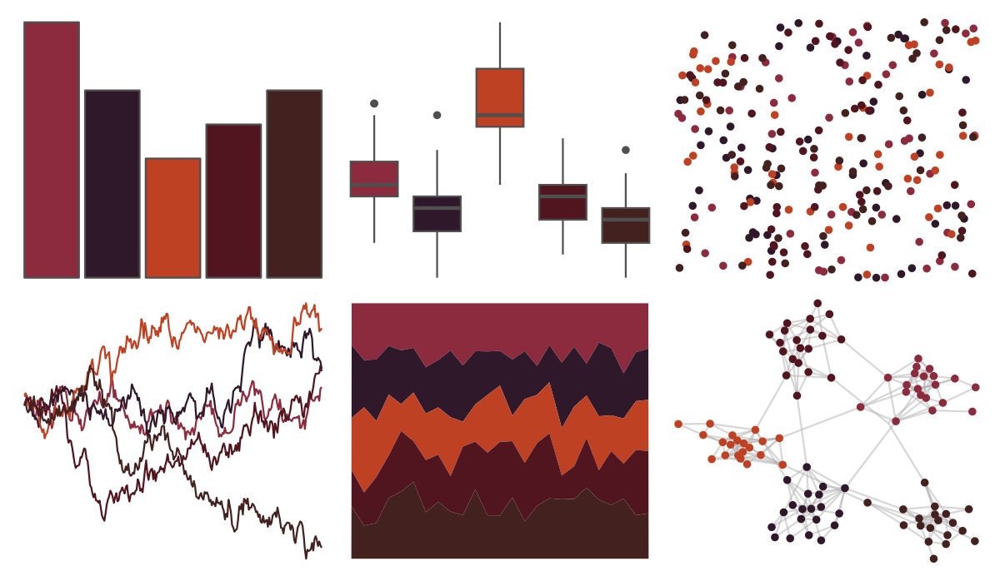

# ButterflyColors - fountainea_ryphea 

::: columns
::: {.column width="50%"}

**Github**

[junqueiragaabi/ButterflyColors](https://github.com/junqueiragaabi/ButterflyColors)
:::

::: {.column width="50%"}

**CRAN**

Not on CRAN
:::
:::

<hr> 

Use with [paletteer](https://emilhvitfeldt.github.io/paletteer/) package:

```r
library(paletteer)
paletteer_d("ButterflyColors::fountainea_ryphea")
```

Use raw:

```r
c("#8C2B3DFF", "#2F182AFF", "#BF4124FF", "#51151FFF", "#43211FFF")
``` 

 

<br>

# Related Palettes

<div class="list" style="display: grid; grid-template-columns: auto auto auto;"> <figure class="figure">
<a href="../../amerika/Dem_Ind_Rep3/"> </a>
</figure> <figure class="figure">
<a href="../../beyonce/X4/"> </a>
</figure> <figure class="figure">
<a href="../../ButterflyColors/chorinea_licursis/"> </a>
</figure> <figure class="figure">
<a href="../../nbapalettes/blazers_city2/"> </a>
</figure> <figure class="figure">
<a href="../../wesanderson/BottleRocket1/"> </a>
</figure> <figure class="figure">
<a href="../../yarrr/brave/"> </a>
</figure> <figure class="figure">
<a href="../../NineteenEightyR/cobra/"> </a>
</figure> <figure class="figure">
<a href="../../MoMAColors/Althoff/"> </a>
</figure> <figure class="figure">
<a href="../../calecopal/vermillion/"> </a>
</figure> <figure class="figure">
<a href="../../beyonce/X8/"> </a>
</figure> <figure class="figure">
<a href="../../beyonce/X20/"> </a>
</figure> <figure class="figure">
<a href="../../ggsci/hallmarks_dark_cosmic/"> </a>
</figure> 
</div>
