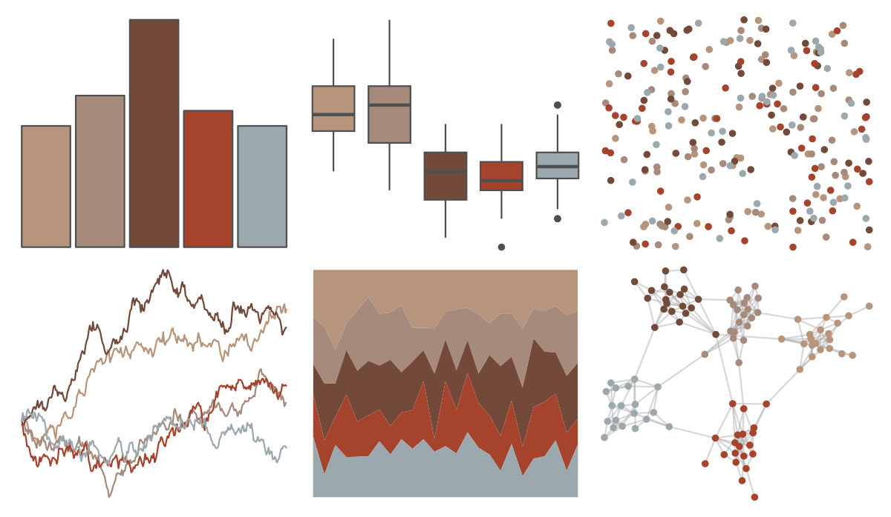

# ButterflyColors - hamadryas_feronia 

::: columns
::: {.column width="50%"}

**Github**

[junqueiragaabi/ButterflyColors](https://github.com/junqueiragaabi/ButterflyColors)
:::

::: {.column width="50%"}

**CRAN**

Not on CRAN
:::
:::

<hr> 

Use with [paletteer](https://emilhvitfeldt.github.io/paletteer/) package:

```r
library(paletteer)
paletteer_d("ButterflyColors::hamadryas_feronia")
```

Use raw:

```r
c("#B7957CFF", "#A68A7BFF", "#734939FF", "#A6432DFF", "#9BA8AEFF")
``` 

 

<br>

# Related Palettes

<div class="list" style="display: grid; grid-template-columns: auto auto auto;"> <figure class="figure">
<a href="../../amerika/Dem_Ind_Rep3/"> </a>
</figure> <figure class="figure">
<a href="../../calecopal/calochortus/"> </a>
</figure> <figure class="figure">
<a href="../../tayloRswift/RoseGardenPink1989/"> </a>
</figure> <figure class="figure">
<a href="../../ochRe/williams_pilbara/"> </a>
</figure> <figure class="figure">
<a href="../../ButterflyColors/synargis_calyce/"> </a>
</figure> <figure class="figure">
<a href="../../ggthemes/excel_Orange_Red/"> </a>
</figure> <figure class="figure">
<a href="../../ggthemes/excel_Wood_Type/"> </a>
</figure> <figure class="figure">
<a href="../../ButterflyColors/danaus_eresimus/"> </a>
</figure> <figure class="figure">
<a href="../../tayloRswift/TS1989/"> </a>
</figure> <figure class="figure">
<a href="../../colRoz/m_oscellata/"> </a>
</figure> <figure class="figure">
<a href="../../NatParksPalettes/BryceCanyon/"> </a>
</figure> <figure class="figure">
<a href="../../lisa/JosefAlbers/"> </a>
</figure> 
</div>
