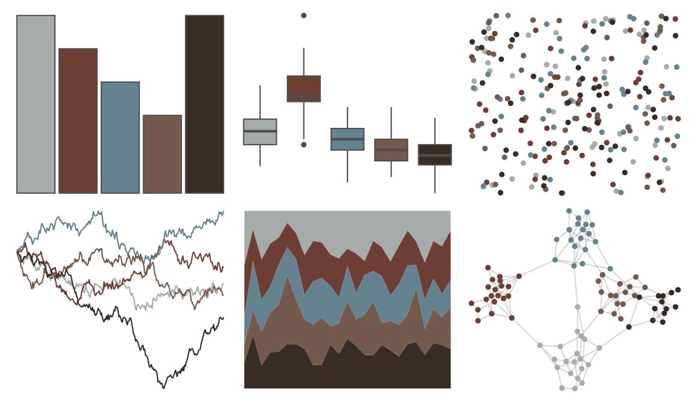

# ButterflyColors - hamadryas_feronia_2 

::: columns
::: {.column width="50%"}

**Github**

[junqueiragaabi/ButterflyColors](https://github.com/junqueiragaabi/ButterflyColors)
:::

::: {.column width="50%"}

**CRAN**

Not on CRAN
:::
:::

<hr> 

Use with [paletteer](https://emilhvitfeldt.github.io/paletteer/) package:

```r
library(paletteer)
paletteer_d("ButterflyColors::hamadryas_feronia_2")
```

Use raw:

```r
c("#A6ACAAFF", "#6D3E34FF", "#658290FF", "#735A4CFF", "#372C26FF")
``` 

 

<br>

# Related Palettes

<div class="list" style="display: grid; grid-template-columns: auto auto auto;"> <figure class="figure">
<a href="../../amerika/Dem_Ind_Rep3/"> </a>
</figure> <figure class="figure">
<a href="../../werpals/cinderella/"> </a>
</figure> <figure class="figure">
<a href="../../NatParksPalettes/RockyMtn/"> </a>
</figure> <figure class="figure">
<a href="../../DresdenColor/deathmasks/"> </a>
</figure> <figure class="figure">
<a href="../../Manu/Kereru_orig/"> </a>
</figure> <figure class="figure">
<a href="../../severance/Jazz02/"> </a>
</figure> <figure class="figure">
<a href="../../DresdenColor/deadbeat/"> </a>
</figure> <figure class="figure">
<a href="../../Manu/Putangitangi/"> </a>
</figure> <figure class="figure">
<a href="../../lisa/ReneMagritte_1/"> </a>
</figure> <figure class="figure">
<a href="../../MetBrewer/Pillement/"> </a>
</figure> <figure class="figure">
<a href="../../severance/Hell/"> </a>
</figure> <figure class="figure">
<a href="../../ButterflyColors/parides_zacynthus_polymetus/"> </a>
</figure> 
</div>
