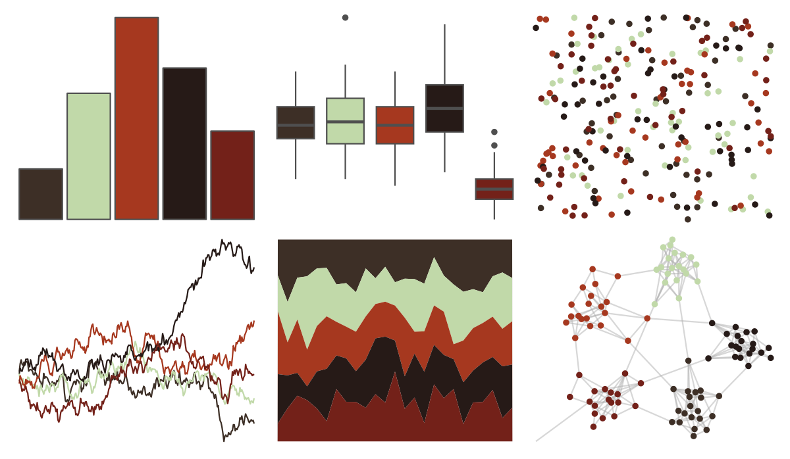

# ButterflyColors - heliconius_erato_phyllis 

::: columns
::: {.column width="50%"}

**Github**

[junqueiragaabi/ButterflyColors](https://github.com/junqueiragaabi/ButterflyColors)
:::

::: {.column width="50%"}

**CRAN**

Not on CRAN
:::
:::

<hr> 

Use with [paletteer](https://emilhvitfeldt.github.io/paletteer/) package:

```r
library(paletteer)
paletteer_d("ButterflyColors::heliconius_erato_phyllis")
```

Use raw:

```r
c("#3D2F26FF", "#C1D9A9FF", "#A6381FFF", "#261A17FF", "#732119FF")
``` 

 

<br>

# Related Palettes

<div class="list" style="display: grid; grid-template-columns: auto auto auto;"> <figure class="figure">
<a href="../../awtools/a_palette/"> </a>
</figure> <figure class="figure">
<a href="../../ButterflyColors/hamadryas_feronia/"> </a>
</figure> <figure class="figure">
<a href="../../ButterflyColors/hamadryas_feronia/"> </a>
</figure> <figure class="figure">
<a href="../../futurevisions/enceladus/"> </a>
</figure> <figure class="figure">
<a href="../../lisa/BarnettNewman/"> </a>
</figure> <figure class="figure">
<a href="../../MexBrewer/Aurora/"> </a>
</figure> <figure class="figure">
<a href="../../lisa/LorserFeitelson/"> </a>
</figure> <figure class="figure">
<a href="../../tayloRswift/taylorRed/"> </a>
</figure> <figure class="figure">
<a href="../../lisa/DiegoVelazquez/"> </a>
</figure> <figure class="figure">
<a href="../../ButterflyColors/danaus_erippus/"> </a>
</figure> <figure class="figure">
<a href="../../beyonce/X103/"> </a>
</figure> <figure class="figure">
<a href="../../colRoz/p_breviceps/"> </a>
</figure> 
</div>
