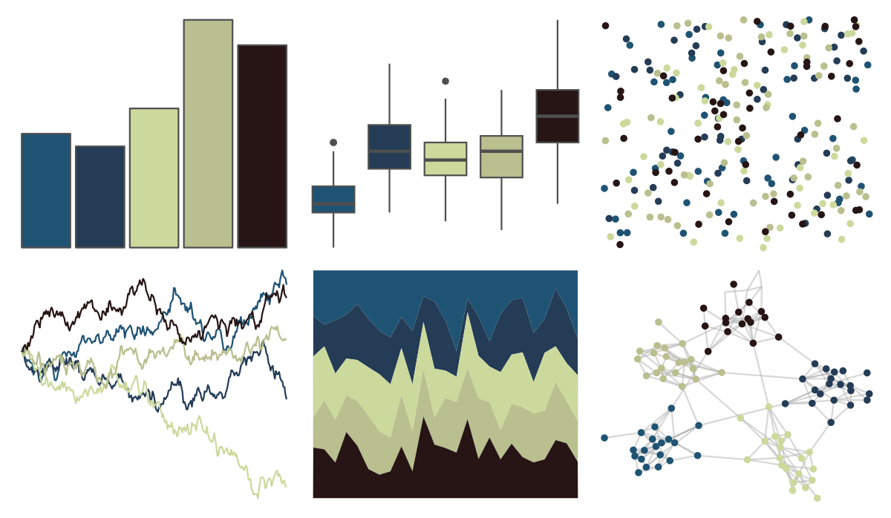

# ButterflyColors - heliconius_sara_apseudes 

::: columns
::: {.column width="50%"}

**Github**

[junqueiragaabi/ButterflyColors](https://github.com/junqueiragaabi/ButterflyColors)
:::

::: {.column width="50%"}

**CRAN**

Not on CRAN
:::
:::

<hr> 

Use with [paletteer](https://emilhvitfeldt.github.io/paletteer/) package:

```r
library(paletteer)
paletteer_d("ButterflyColors::heliconius_sara_apseudes")
```

Use raw:

```r
c("#1F5373FF", "#243C56FF", "#CCD99CFF", "#B9BF8EFF", "#261514FF")
``` 

 

<br>

# Related Palettes

<div class="list" style="display: grid; grid-template-columns: auto auto auto;"> <figure class="figure">
<a href="../../awtools/a_palette/"> </a>
</figure> <figure class="figure">
<a href="../../ButterflyColors/hamadryas_feronia/"> </a>
</figure> <figure class="figure">
<a href="../../ButterflyColors/hamadryas_feronia/"> </a>
</figure> <figure class="figure">
<a href="../../ghibli/YesterdayMedium/"> </a>
</figure> <figure class="figure">
<a href="../../lisa/VincentvanGogh/"> </a>
</figure> <figure class="figure">
<a href="../../vangogh/StarryRhone/"> </a>
</figure> <figure class="figure">
<a href="../../lisa/KatsushikaHokusai/"> </a>
</figure> <figure class="figure">
<a href="../../PrettyCols/Sea/"> </a>
</figure> <figure class="figure">
<a href="../../MoMAColors/Ernst/"> </a>
</figure> <figure class="figure">
<a href="../../rtist/hopper/"> </a>
</figure> <figure class="figure">
<a href="../../MoMAColors/VanGogh/"> </a>
</figure> <figure class="figure">
<a href="../../vangogh/Eglise/"> </a>
</figure> 
</div>
