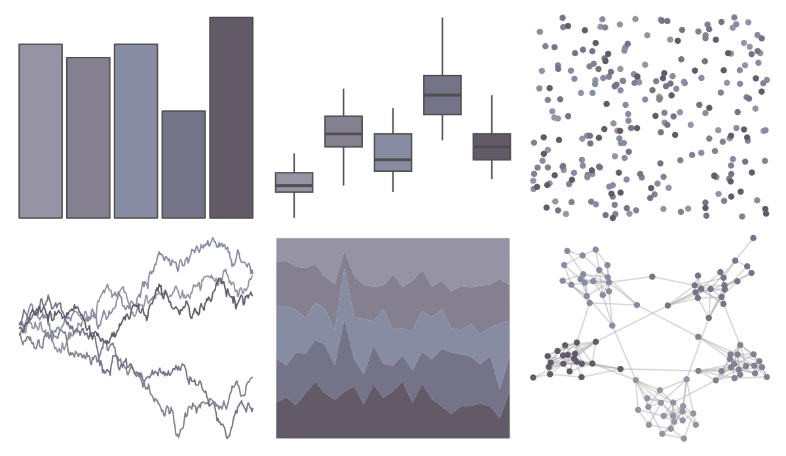

# ButterflyColors - hemiargus_hanno 

::: columns
::: {.column width="50%"}

**Github**

[junqueiragaabi/ButterflyColors](https://github.com/junqueiragaabi/ButterflyColors)
:::

::: {.column width="50%"}

**CRAN**

Not on CRAN
:::
:::

<hr> 

Use with [paletteer](https://emilhvitfeldt.github.io/paletteer/) package:

```r
library(paletteer)
paletteer_d("ButterflyColors::hemiargus_hanno")
```

Use raw:

```r
c("#9693A4FF", "#84808FFF", "#878CA2FF", "#757388FF", "#625A67FF")
``` 

 

<br>

# Related Palettes

<div class="list" style="display: grid; grid-template-columns: auto auto auto;"> <figure class="figure">
<a href="../../amerika/Dem_Ind_Rep3/"> </a>
</figure> <figure class="figure">
<a href="../../Rdune/harkonnen2/"> </a>
</figure> <figure class="figure">
<a href="../../ggthemes/excel_Violet/"> </a>
</figure> <figure class="figure">
<a href="../../musculusColors/ErMole/"> </a>
</figure> <figure class="figure">
<a href="../../fishualize/Mycteroperca_bonaci/"> </a>
</figure> <figure class="figure">
<a href="../../calecopal/casj/"> </a>
</figure> <figure class="figure">
<a href="../../ggthemes/Seattle_Grays/"> </a>
</figure> <figure class="figure">
<a href="../../musculusColors/ErWhale/"> </a>
</figure> <figure class="figure">
<a href="../../unikn/pal_grau/"> </a>
</figure> <figure class="figure">
<a href="../../ggthemes/Classic_Gray_5/"> </a>
</figure> <figure class="figure">
<a href="../../Rdune/atreides4/"> </a>
</figure> <figure class="figure">
<a href="../../Manu/Kereru/"> </a>
</figure> 
</div>
