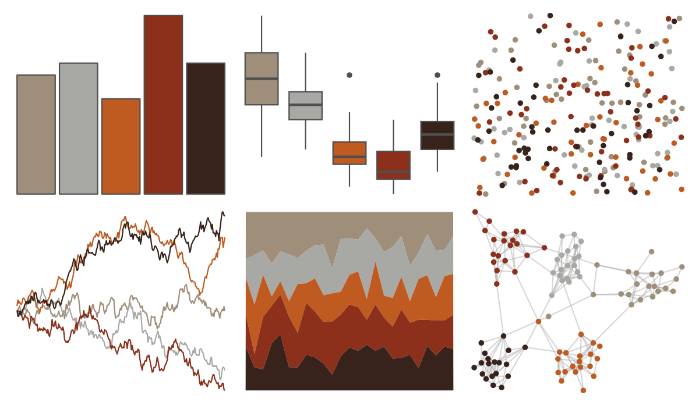
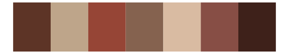

# ButterflyColors - historis_acheronta 

::: columns
::: {.column width="50%"}

**Github**

[junqueiragaabi/ButterflyColors](https://github.com/junqueiragaabi/ButterflyColors)
:::

::: {.column width="50%"}

**CRAN**

Not on CRAN
:::
:::

<hr> 

Use with [paletteer](https://emilhvitfeldt.github.io/paletteer/) package:

```r
library(paletteer)
paletteer_d("ButterflyColors::historis_acheronta")
```

Use raw:

```r
c("#9F8E7AFF", "#A8A9A4FF", "#BF5B21FF", "#8C2F1BFF", "#37231CFF")
``` 

 

<br>

# Related Palettes

<div class="list" style="display: grid; grid-template-columns: auto auto auto;"> <figure class="figure">
<a href="../../amerika/Dem_Ind_Rep3/"> </a>
</figure> <figure class="figure">
<a href="../../ButterflyColors/danaus_erippus/"> </a>
</figure> <figure class="figure">
<a href="../../DresdenColor/turncoat/"> </a>
</figure> <figure class="figure">
<a href="../../ButterflyColors/lycorea_hallia/"> </a>
</figure> <figure class="figure">
<a href="../../ButterflyColors/danaus_gilippus/"> </a>
</figure> <figure class="figure">
<a href="../../colRoz/p_cincta/"> </a>
</figure> <figure class="figure">
<a href="../../ButterflyColors/stalachtis_phlegia_susanna/"> </a>
</figure> <figure class="figure">
<a href="../../ButterflyColors/synargis_calyce/"> </a>
</figure> <figure class="figure">
<a href="../../werpals/firefly/"> </a>
</figure> <figure class="figure">
<a href="../../dutchmasters/anatomy/"> </a>
</figure> <figure class="figure">
<a href="../../ButterflyColors/danaus_eresimus/"> </a>
</figure> <figure class="figure">
<a href="../../ButterflyColors/smyrna_blomfidiana/"> </a>
</figure> 
</div>
