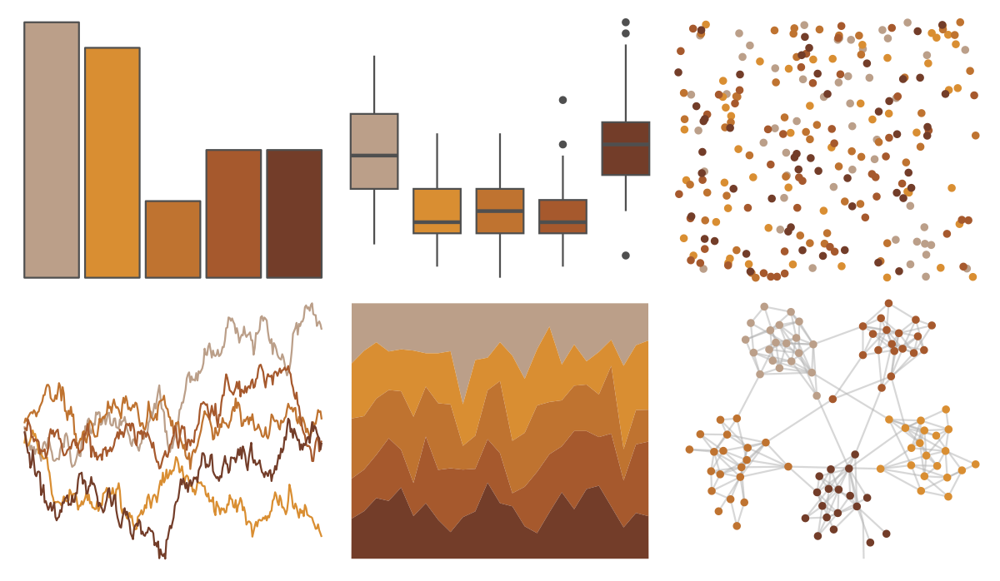

# ButterflyColors - hylephila_phyleus 

::: columns
::: {.column width="50%"}

**Github**

[junqueiragaabi/ButterflyColors](https://github.com/junqueiragaabi/ButterflyColors)
:::

::: {.column width="50%"}

**CRAN**

Not on CRAN
:::
:::

<hr> 

Use with [paletteer](https://emilhvitfeldt.github.io/paletteer/) package:

```r
library(paletteer)
paletteer_d("ButterflyColors::hylephila_phyleus")
```

Use raw:

```r
c("#BB9F89FF", "#D98E32FF", "#BF7330FF", "#A6592DFF", "#733D29FF")
``` 

 

<br>

# Related Palettes

<div class="list" style="display: grid; grid-template-columns: auto auto auto;"> <figure class="figure">
<a href="../../awtools/a_palette/"> </a>
</figure> <figure class="figure">
<a href="../../ButterflyColors/hamadryas_feronia/"> </a>
</figure> <figure class="figure">
<a href="../../ButterflyColors/hamadryas_feronia/"> </a>
</figure> <figure class="figure">
<a href="../../ggthemes/excel_Red/"> </a>
</figure> <figure class="figure">
<a href="../../ButterflyColors/junonia_evarete/"> </a>
</figure> <figure class="figure">
<a href="../../ButterflyColors/brassolis_sophorae/"> </a>
</figure> <figure class="figure">
<a href="../../fishualize/Pleuronectes_platessa/"> </a>
</figure> <figure class="figure">
<a href="../../calecopal/dudleya/"> </a>
</figure> <figure class="figure">
<a href="../../ggthemes/excel_Yellow_Orange/"> </a>
</figure> <figure class="figure">
<a href="../../vangogh/Shoes/"> </a>
</figure> <figure class="figure">
<a href="../../lisa/JohannJacobUlrich/"> </a>
</figure> <figure class="figure">
<a href="../../ggthemes/excel_Retrospect/"> </a>
</figure> 
</div>
