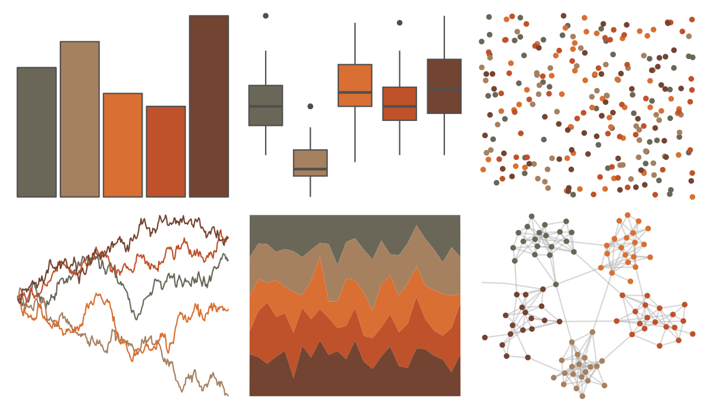

# ButterflyColors - junonia_evarete 

::: columns
::: {.column width="50%"}

**Github**

[junqueiragaabi/ButterflyColors](https://github.com/junqueiragaabi/ButterflyColors)
:::

::: {.column width="50%"}

**CRAN**

Not on CRAN
:::
:::

<hr> 

Use with [paletteer](https://emilhvitfeldt.github.io/paletteer/) package:

```r
library(paletteer)
paletteer_d("ButterflyColors::junonia_evarete")
```

Use raw:

```r
c("#6A6758FF", "#A68160FF", "#D96F32FF", "#BF522AFF", "#734432FF")
``` 

 

<br>

# Related Palettes

<div class="list" style="display: grid; grid-template-columns: auto auto auto;"> <figure class="figure">
<a href="../../amerika/Dem_Ind_Rep3/"> </a>
</figure> <figure class="figure">
<a href="../../ButterflyColors/hylephila_phyleus/"> </a>
</figure> <figure class="figure">
<a href="../../ggthemes/excel_Red/"> </a>
</figure> <figure class="figure">
<a href="../../ggthemes/excel_Orange_Red/"> </a>
</figure> <figure class="figure">
<a href="../../ggthemes/excel_Wood_Type/"> </a>
</figure> <figure class="figure">
<a href="../../ButterflyColors/brassolis_sophorae/"> </a>
</figure> <figure class="figure">
<a href="../../fishualize/Pleuronectes_platessa/"> </a>
</figure> <figure class="figure">
<a href="../../ButterflyColors/marpesia_petreus/"> </a>
</figure> <figure class="figure">
<a href="../../NatParksPalettes/BryceCanyon/"> </a>
</figure> <figure class="figure">
<a href="../../NatParksPalettes/Halekala/"> </a>
</figure> <figure class="figure">
<a href="../../fishualize/Labrisomus_cricota/"> </a>
</figure> <figure class="figure">
<a href="../../fishualize/Pareiorhaphis_garbei/"> </a>
</figure> 
</div>
