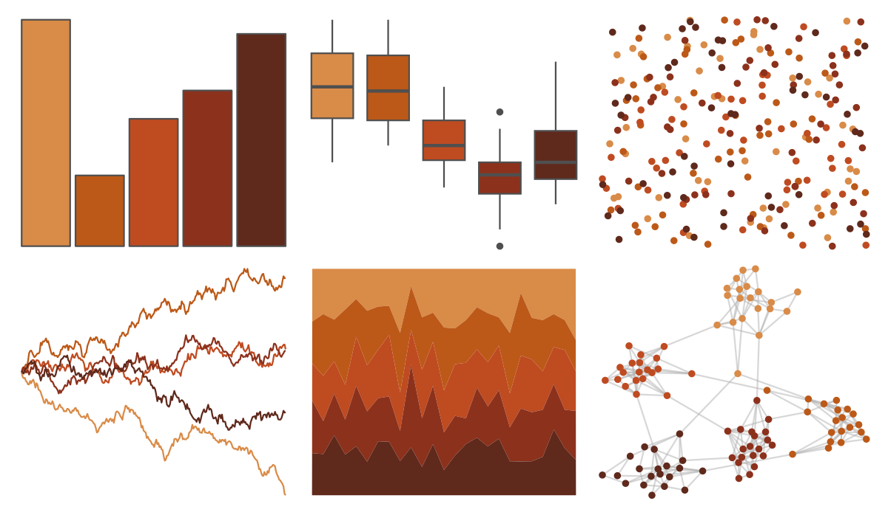

# ButterflyColors - marpesia_petreus 

::: columns
::: {.column width="50%"}

**Github**

[junqueiragaabi/ButterflyColors](https://github.com/junqueiragaabi/ButterflyColors)
:::

::: {.column width="50%"}

**CRAN**

Not on CRAN
:::
:::

<hr> 

Use with [paletteer](https://emilhvitfeldt.github.io/paletteer/) package:

```r
library(paletteer)
paletteer_d("ButterflyColors::marpesia_petreus")
```

Use raw:

```r
c("#D98B48FF", "#BC5918FF", "#BF4B21FF", "#8C311CFF", "#5F291CFF")
``` 

 

<br>

# Related Palettes

<div class="list" style="display: grid; grid-template-columns: auto auto auto;"> <figure class="figure">
<a href="../../awtools/a_palette/"> </a>
</figure> <figure class="figure">
<a href="../../ButterflyColors/hamadryas_feronia/"> </a>
</figure> <figure class="figure">
<a href="../../ButterflyColors/hamadryas_feronia/"> </a>
</figure> <figure class="figure">
<a href="../../fishualize/Pleuronectes_platessa/"> </a>
</figure> <figure class="figure">
<a href="../../MetBrewer/Peru2/"> </a>
</figure> <figure class="figure">
<a href="../../miscpalettes/chocolate/"> </a>
</figure> <figure class="figure">
<a href="../../fishualize/Acanthostracion_polygonius_y/"> </a>
</figure> <figure class="figure">
<a href="../../fishualize/Pareiorhaphis_garbei/"> </a>
</figure> <figure class="figure">
<a href="../../ButterflyColors/junonia_evarete/"> </a>
</figure> <figure class="figure">
<a href="../../rockthemes/alice/"> </a>
</figure> <figure class="figure">
<a href="../../ButterflyColors/catagramma_pygas/"> </a>
</figure> <figure class="figure">
<a href="../../ButterflyColors/hylephila_phyleus/"> </a>
</figure> 
</div>
