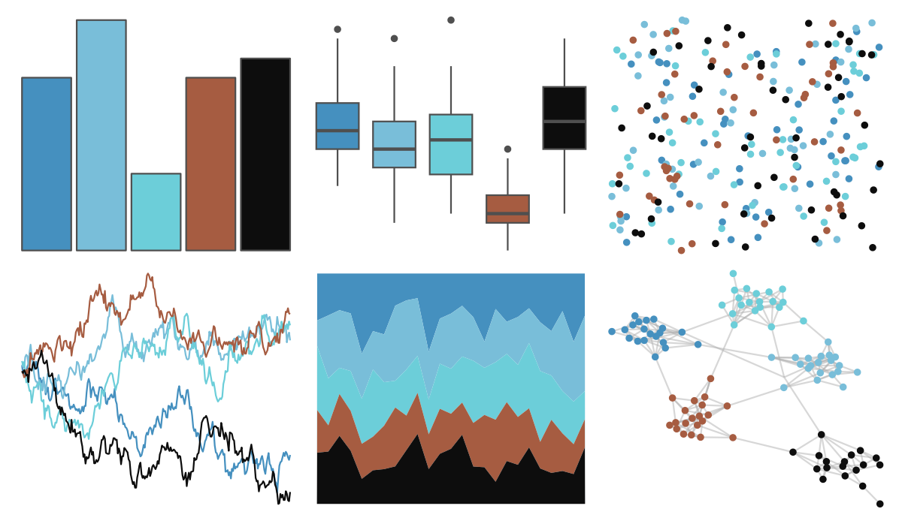

# ButterflyColors - morpho_helenor 

::: columns
::: {.column width="50%"}

**Github**

[junqueiragaabi/ButterflyColors](https://github.com/junqueiragaabi/ButterflyColors)
:::

::: {.column width="50%"}

**CRAN**

Not on CRAN
:::
:::

<hr> 

Use with [paletteer](https://emilhvitfeldt.github.io/paletteer/) package:

```r
library(paletteer)
paletteer_d("ButterflyColors::morpho_helenor")
```

Use raw:

```r
c("#4590BFFF", "#79BED9FF", "#6CCED9FF", "#A65C41FF", "#0D0D0DFF")
``` 

 

<br>

# Related Palettes

<div class="list" style="display: grid; grid-template-columns: auto auto auto;"> <figure class="figure">
<a href="../../awtools/a_palette/"> </a>
</figure> <figure class="figure">
<a href="../../ButterflyColors/hamadryas_feronia/"> </a>
</figure> <figure class="figure">
<a href="../../ButterflyColors/hamadryas_feronia/"> </a>
</figure> <figure class="figure">
<a href="../../calecopal/grasswet/"> </a>
</figure> <figure class="figure">
<a href="../../DresdenColor/deadbeat/"> </a>
</figure> <figure class="figure">
<a href="../../Manu/Tui/"> </a>
</figure> <figure class="figure">
<a href="../../calecopal/sage/"> </a>
</figure> <figure class="figure">
<a href="../../nbapalettes/heat_military/"> </a>
</figure> <figure class="figure">
<a href="../../lisa/MarkRothko_1/"> </a>
</figure> <figure class="figure">
<a href="../../vangogh/Cypresses/"> </a>
</figure> <figure class="figure">
<a href="../../colRoz/i_lesueurii/"> </a>
</figure> <figure class="figure">
<a href="../../beyonce/X125/"> </a>
</figure> 
</div>
