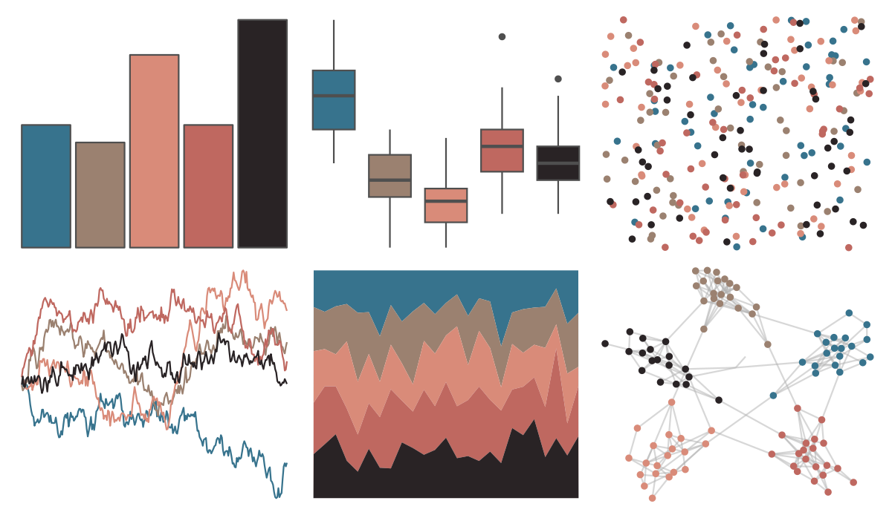

# ButterflyColors - parides_zacynthus_polymetus 

::: columns
::: {.column width="50%"}

**Github**

[junqueiragaabi/ButterflyColors](https://github.com/junqueiragaabi/ButterflyColors)
:::

::: {.column width="50%"}

**CRAN**

Not on CRAN
:::
:::

<hr> 

Use with [paletteer](https://emilhvitfeldt.github.io/paletteer/) package:

```r
library(paletteer)
paletteer_d("ButterflyColors::parides_zacynthus_polymetus")
```

Use raw:

```r
c("#37738DFF", "#9B8170FF", "#D98B79FF", "#BF6860FF", "#292325FF")
``` 

 

<br>

# Related Palettes

<div class="list" style="display: grid; grid-template-columns: auto auto auto;"> <figure class="figure">
<a href="../../awtools/a_palette/"> </a>
</figure> <figure class="figure">
<a href="../../ButterflyColors/hamadryas_feronia/"> </a>
</figure> <figure class="figure">
<a href="../../ButterflyColors/hamadryas_feronia/"> </a>
</figure> <figure class="figure">
<a href="../../Manu/Putangitangi/"> </a>
</figure> <figure class="figure">
<a href="../../MoMAColors/Picasso/"> </a>
</figure> <figure class="figure">
<a href="../../werpals/when_i_was_your_age/"> </a>
</figure> <figure class="figure">
<a href="../../fishualize/Oncorhynchus_kisutch/"> </a>
</figure> <figure class="figure">
<a href="../../tvthemes/Dusk/"> </a>
</figure> <figure class="figure">
<a href="../../beyonce/X1/"> </a>
</figure> <figure class="figure">
<a href="../../rtist/degas/"> </a>
</figure> <figure class="figure">
<a href="../../beyonce/X38/"> </a>
</figure> <figure class="figure">
<a href="../../colRoz/m_oscellata/"> </a>
</figure> 
</div>
