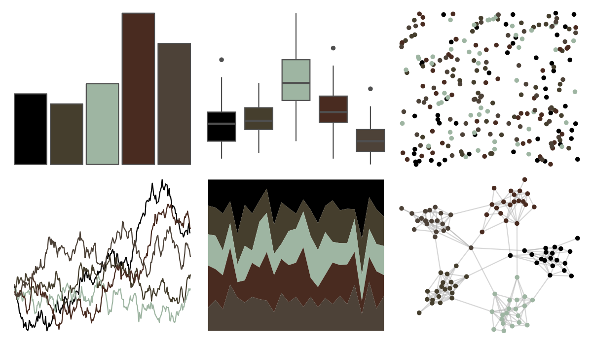

# ButterflyColors - philaethria_dido 

::: columns
::: {.column width="50%"}

**Github**

[junqueiragaabi/ButterflyColors](https://github.com/junqueiragaabi/ButterflyColors)
:::

::: {.column width="50%"}

**CRAN**

Not on CRAN
:::
:::

<hr> 

Use with [paletteer](https://emilhvitfeldt.github.io/paletteer/) package:

```r
library(paletteer)
paletteer_d("ButterflyColors::philaethria_dido")
```

Use raw:

```r
c("#000000FF", "#453E2DFF", "#9EB5A2FF", "#492B20FF", "#4D4238FF")
``` 

 

<br>

# Related Palettes

<div class="list" style="display: grid; grid-template-columns: auto auto auto;"> <figure class="figure">
<a href="../../awtools/a_palette/"> </a>
</figure> <figure class="figure">
<a href="../../ButterflyColors/hamadryas_feronia/"> </a>
</figure> <figure class="figure">
<a href="../../ButterflyColors/hamadryas_feronia/"> </a>
</figure> <figure class="figure">
<a href="../../colRoz/kimberley/"> </a>
</figure> <figure class="figure">
<a href="../../beyonce/X103/"> </a>
</figure> <figure class="figure">
<a href="../../lisa/C_M_Coolidge/"> </a>
</figure> <figure class="figure">
<a href="../../MexBrewer/Taurus2/"> </a>
</figure> <figure class="figure">
<a href="../../lisa/DiegoVelazquez/"> </a>
</figure> <figure class="figure">
<a href="../../ButterflyColors/heliconius_erato_phyllis/"> </a>
</figure> <figure class="figure">
<a href="../../MexBrewer/Aurora/"> </a>
</figure> <figure class="figure">
<a href="../../ghibli/TotoroMedium/"> </a>
</figure> <figure class="figure">
<a href="../../severance/Jazz02/"> </a>
</figure> 
</div>
