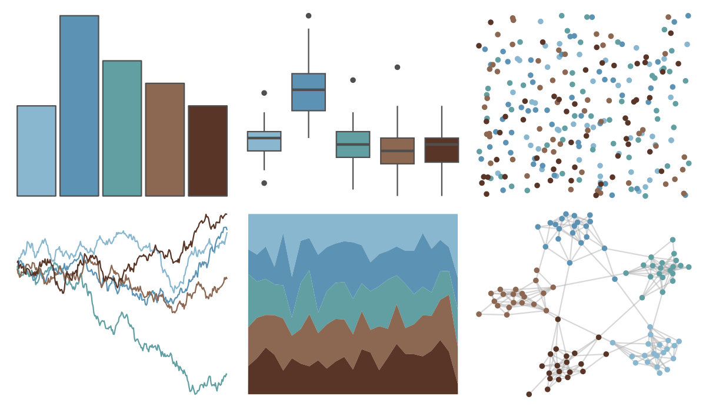

# ButterflyColors - pseudolycaena_marsyas 

::: columns
::: {.column width="50%"}

**Github**

[junqueiragaabi/ButterflyColors](https://github.com/junqueiragaabi/ButterflyColors)
:::

::: {.column width="50%"}

**CRAN**

Not on CRAN
:::
:::

<hr> 

Use with [paletteer](https://emilhvitfeldt.github.io/paletteer/) package:

```r
library(paletteer)
paletteer_d("ButterflyColors::pseudolycaena_marsyas")
```

Use raw:

```r
c("#89B7CFFF", "#5C92B4FF", "#619FA2FF", "#8C6751FF", "#593527FF")
``` 

 

<br>

# Related Palettes

<div class="list" style="display: grid; grid-template-columns: auto auto auto;"> <figure class="figure">
<a href="../../ButterflyColors/hamadryas_feronia/"> </a>
</figure> <figure class="figure">
<a href="../../ButterflyColors/hamadryas_feronia/"> </a>
</figure> <figure class="figure">
<a href="../../ButterflyColors/hamadryas_feronia/"> </a>
</figure> <figure class="figure">
<a href="../../fishualize/Oncorhynchus_gorbuscha/"> </a>
</figure> <figure class="figure">
<a href="../../ButterflyColors/astraptes_fulgerator/"> </a>
</figure> <figure class="figure">
<a href="../../Manu/Korora/"> </a>
</figure> <figure class="figure">
<a href="../../Manu/Kereru_orig/"> </a>
</figure> <figure class="figure">
<a href="../../colRoz/salt_lake/"> </a>
</figure> <figure class="figure">
<a href="../../beyonce/X6/"> </a>
</figure> <figure class="figure">
<a href="../../DresdenColor/deathmasks/"> </a>
</figure> <figure class="figure">
<a href="../../nord/baie_mouton/"> </a>
</figure> <figure class="figure">
<a href="../../vangogh/Landscape/"> </a>
</figure> 
</div>
