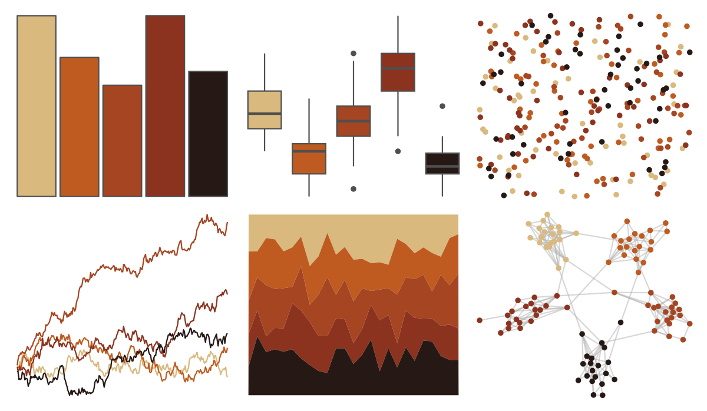

# ButterflyColors - smyrna_blomfidiana 

::: columns
::: {.column width="50%"}

**Github**

[junqueiragaabi/ButterflyColors](https://github.com/junqueiragaabi/ButterflyColors)
:::

::: {.column width="50%"}

**CRAN**

Not on CRAN
:::
:::

<hr> 

Use with [paletteer](https://emilhvitfeldt.github.io/paletteer/) package:

```r
library(paletteer)
paletteer_d("ButterflyColors::smyrna_blomfidiana")
```

Use raw:

```r
c("#D9B97EFF", "#BF5B21FF", "#A64521FF", "#8C331FFF", "#261915FF")
``` 

 

<br>

# Related Palettes

<div class="list" style="display: grid; grid-template-columns: auto auto auto;"> <figure class="figure">
<a href="../../awtools/a_palette/"> </a>
</figure> <figure class="figure">
<a href="../../ButterflyColors/hamadryas_feronia/"> </a>
</figure> <figure class="figure">
<a href="../../ButterflyColors/hamadryas_feronia/"> </a>
</figure> <figure class="figure">
<a href="../../DresdenColor/turncoat/"> </a>
</figure> <figure class="figure">
<a href="../../ButterflyColors/danaus_erippus/"> </a>
</figure> <figure class="figure">
<a href="../../fishualize/Pterois_volitans/"> </a>
</figure> <figure class="figure">
<a href="../../colRoz/v_pilbarensis/"> </a>
</figure> <figure class="figure">
<a href="../../ButterflyColors/lycorea_hallia/"> </a>
</figure> <figure class="figure">
<a href="../../lisa/CharlesDemuth/"> </a>
</figure> <figure class="figure">
<a href="../../MetBrewer/Peru2/"> </a>
</figure> <figure class="figure">
<a href="../../ButterflyColors/historis_acheronta/"> </a>
</figure> <figure class="figure">
<a href="../../fishualize/Pseudupeneus_maculatus/"> </a>
</figure> 
</div>
