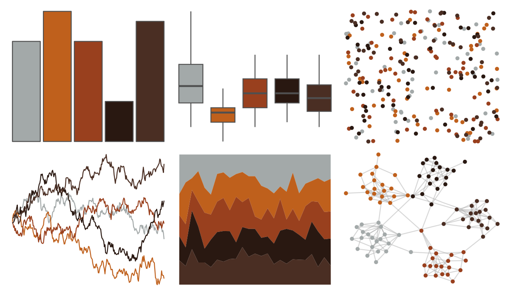

# ButterflyColors - stalachtis_phlegia_susanna 

::: columns
::: {.column width="50%"}

**Github**

[junqueiragaabi/ButterflyColors](https://github.com/junqueiragaabi/ButterflyColors)
:::

::: {.column width="50%"}

**CRAN**

Not on CRAN
:::
:::

<hr> 

Use with [paletteer](https://emilhvitfeldt.github.io/paletteer/) package:

```r
library(paletteer)
paletteer_d("ButterflyColors::stalachtis_phlegia_susanna")
```

Use raw:

```r
c("#A3A9A9FF", "#BF601CFF", "#99401EFF", "#291811FF", "#4A2E23FF")
``` 

 

<br>

# Related Palettes

<div class="list" style="display: grid; grid-template-columns: auto auto auto;"> <figure class="figure">
<a href="../../amerika/Dem_Ind_Rep3/"> </a>
</figure> <figure class="figure">
<a href="../../ButterflyColors/historis_acheronta/"> </a>
</figure> <figure class="figure">
<a href="../../colRoz/p_cincta/"> </a>
</figure> <figure class="figure">
<a href="../../MoMAColors/Clay/"> </a>
</figure> <figure class="figure">
<a href="../../DresdenColor/turncoat/"> </a>
</figure> <figure class="figure">
<a href="../../nbapalettes/rockets/"> </a>
</figure> <figure class="figure">
<a href="../../peRReo/nicky/"> </a>
</figure> <figure class="figure">
<a href="../../ButterflyColors/danaus_erippus/"> </a>
</figure> <figure class="figure">
<a href="../../dutchmasters/anatomy/"> </a>
</figure> <figure class="figure">
<a href="../../ButterflyColors/danaus_eresimus/"> </a>
</figure> <figure class="figure">
<a href="../../calecopal/grassdry/"> </a>
</figure> <figure class="figure">
<a href="../../nbapalettes/heat_military/"> </a>
</figure> 
</div>
