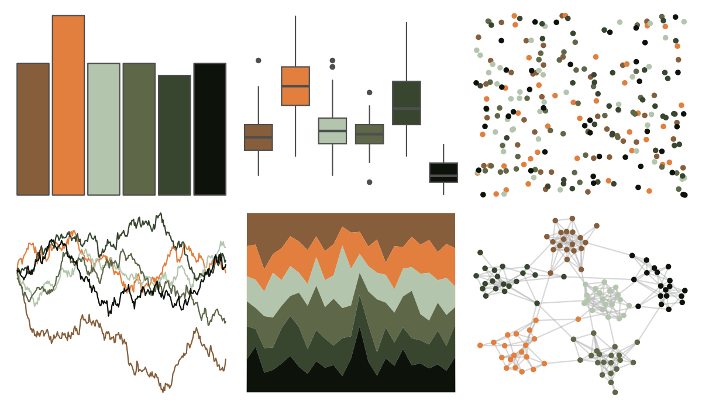

# DresdenColor - bloodrites 

::: columns
::: {.column width="50%"}

**Github**

[katiesaund/DresdenColor](https://github.com/katiesaund/DresdenColor)
:::

::: {.column width="50%"}

**CRAN**

Not on CRAN
:::
:::

<hr> 

Use with [paletteer](https://emilhvitfeldt.github.io/paletteer/) package:

```r
library(paletteer)
paletteer_d("DresdenColor::bloodrites")
```

Use raw:

```r
c("#875E3BFF", "#E37F3EFF", "#B3C6ADFF", "#5E6748FF", "#384630FF", "#0D120BFF")
``` 

 

<br>

# Related Palettes

<div class="list" style="display: grid; grid-template-columns: auto auto auto;"> <figure class="figure">
<a href="../../awtools/a_palette/"> </a>
</figure> <figure class="figure">
<a href="../../DresdenColor/sidejobs/"> </a>
</figure> <figure class="figure">
<a href="../../lisa/GiorgiodeChirico/"> </a>
</figure> <figure class="figure">
<a href="../../fishualize/Pterois_volitans/"> </a>
</figure> <figure class="figure">
<a href="../../lisa/DiegoVelazquez/"> </a>
</figure> <figure class="figure">
<a href="../../Manu/Pohutukawa/"> </a>
</figure> <figure class="figure">
<a href="../../colRoz/m_horridus2/"> </a>
</figure> <figure class="figure">
<a href="../../Manu/Kea/"> </a>
</figure> <figure class="figure">
<a href="../../feathers/superb_fairy_wren/"> </a>
</figure> <figure class="figure">
<a href="../../DresdenColor/turncoat/"> </a>
</figure> <figure class="figure">
<a href="../../lisa/GrantWood/"> </a>
</figure> <figure class="figure">
<a href="../../lisa/FridaKahlo/"> </a>
</figure> 
</div>
