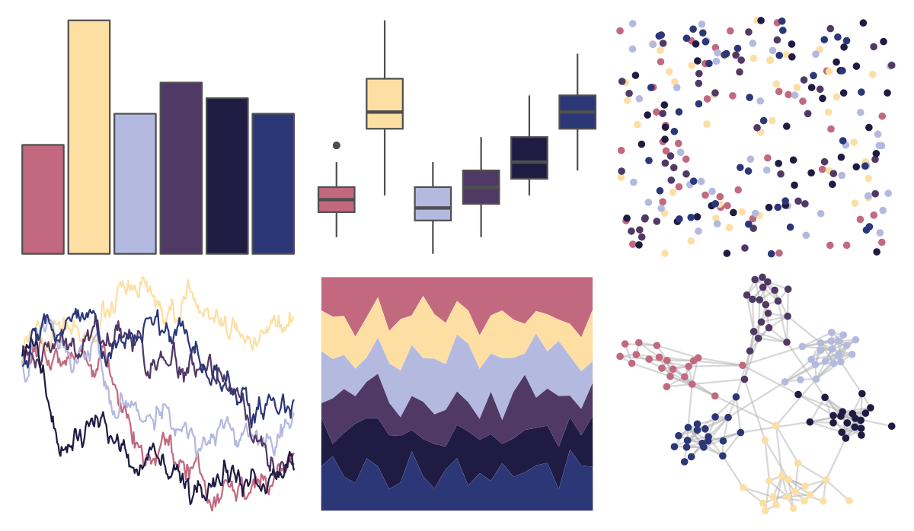

# DresdenColor - briefcases 

::: columns
::: {.column width="50%"}

**Github**

[katiesaund/DresdenColor](https://github.com/katiesaund/DresdenColor)
:::

::: {.column width="50%"}

**CRAN**

Not on CRAN
:::
:::

<hr> 

Use with [paletteer](https://emilhvitfeldt.github.io/paletteer/) package:

```r
library(paletteer)
paletteer_d("DresdenColor::briefcases")
```

Use raw:

```r
c("#C2697FFF", "#FDDFA4FF", "#B4B9E0FF", "#513965FF", "#201B43FF", "#2C3778FF")
``` 

 

<br>

# Related Palettes

<div class="list" style="display: grid; grid-template-columns: auto auto auto;"> <figure class="figure">
<a href="../../awtools/a_palette/"> </a>
</figure> <figure class="figure">
<a href="../../colRoz/desert_dusk/"> </a>
</figure> <figure class="figure">
<a href="../../ghibli/LaputaMedium/"> </a>
</figure> <figure class="figure">
<a href="../../NatParksPalettes/Volcanoes/"> </a>
</figure> <figure class="figure">
<a href="../../MetBrewer/Thomas/"> </a>
</figure> <figure class="figure">
<a href="../../nationalparkcolors/GeneralGrant/"> </a>
</figure> <figure class="figure">
<a href="../../severance/TheYouYouAre/"> </a>
</figure> <figure class="figure">
<a href="../../beyonce/X30/"> </a>
</figure> <figure class="figure">
<a href="../../tvthemes/Sardonyx/"> </a>
</figure> <figure class="figure">
<a href="../../pals/tol/"> </a>
</figure> <figure class="figure">
<a href="../../lisa/YvesKlein/"> </a>
</figure> <figure class="figure">
<a href="../../werpals/alice/"> </a>
</figure> 
</div>
