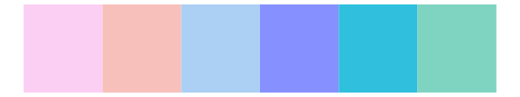

# DresdenColor - colddays 

::: columns
::: {.column width="50%"}

**Github**

[katiesaund/DresdenColor](https://github.com/katiesaund/DresdenColor)
:::

::: {.column width="50%"}

**CRAN**

Not on CRAN
:::
:::

<hr> 

Use with [paletteer](https://emilhvitfeldt.github.io/paletteer/) package:

```r
library(paletteer)
paletteer_d("DresdenColor::colddays")
```

Use raw:

```r
c("#8A8CA4FF", "#D3EEF9FF", "#A0FFFEFF", "#70B7E1FF", "#5074A5FF", "#BFBBA1FF")
``` 

 

<br>

# Related Palettes

<div class="list" style="display: grid; grid-template-columns: auto auto auto;"> <figure class="figure">
<a href="../../awtools/a_palette/"> </a>
</figure> <figure class="figure">
<a href="../../fishualize/Sardinella_brasiliensis/"> </a>
</figure> <figure class="figure">
<a href="../../Redmonder/qMSOBu2/"> </a>
</figure> <figure class="figure">
<a href="../../vapeplot/mallsoft/"> </a>
</figure> <figure class="figure">
<a href="../../vapoRwave/mallSoft/"> </a>
</figure> <figure class="figure">
<a href="../../colorBlindness/Blue2Gray8Steps/"> </a>
</figure> <figure class="figure">
<a href="../../dichromat/BluetoGray_8/"> </a>
</figure> <figure class="figure">
<a href="../../tvthemes/Pearl/"> </a>
</figure> <figure class="figure">
<a href="../../nationalparkcolors/CraterLake/"> </a>
</figure> <figure class="figure">
<a href="../../tvthemes/Opal/"> </a>
</figure> <figure class="figure">
<a href="../../ggthemes/Nuriel_Stone/"> </a>
</figure> <figure class="figure">
<a href="../../fishualize/Harengula_jaguana/"> </a>
</figure> 
</div>
