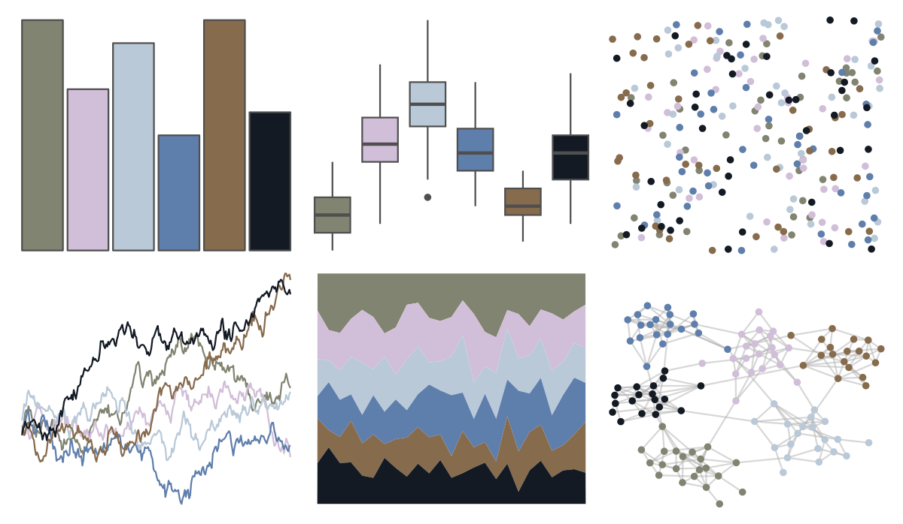

# DresdenColor - deadbeat 

::: columns
::: {.column width="50%"}

**Github**

[katiesaund/DresdenColor](https://github.com/katiesaund/DresdenColor)
:::

::: {.column width="50%"}

**CRAN**

Not on CRAN
:::
:::

<hr> 

Use with [paletteer](https://emilhvitfeldt.github.io/paletteer/) package:

```r
library(paletteer)
paletteer_d("DresdenColor::deadbeat")
```

Use raw:

```r
c("#818470FF", "#D1BED8FF", "#B9C9D8FF", "#5E7EACFF", "#876B4DFF", "#131A24FF")
``` 

 

<br>

# Related Palettes

<div class="list" style="display: grid; grid-template-columns: auto auto auto;"> <figure class="figure">
<a href="../../amerika/Dem_Ind_Rep3/"> </a>
</figure> <figure class="figure">
<a href="../../colRoz/i_lesueurii/"> </a>
</figure> <figure class="figure">
<a href="../../lisa/ReneMagritte_1/"> </a>
</figure> <figure class="figure">
<a href="../../lisa/TheovanDoesburg/"> </a>
</figure> <figure class="figure">
<a href="../../ButterflyColors/hamadryas_feronia_2/"> </a>
</figure> <figure class="figure">
<a href="../../DresdenColor/deathmasks/"> </a>
</figure> <figure class="figure">
<a href="../../werpals/cinderella/"> </a>
</figure> <figure class="figure">
<a href="../../lisa/TheovanDoesburg_1/"> </a>
</figure> <figure class="figure">
<a href="../../rtist/degas/"> </a>
</figure> <figure class="figure">
<a href="../../calecopal/grasswet/"> </a>
</figure> <figure class="figure">
<a href="../../DresdenColor/whitenight/"> </a>
</figure> <figure class="figure">
<a href="../../lisa/MarkRothko_1/"> </a>
</figure> 
</div>
