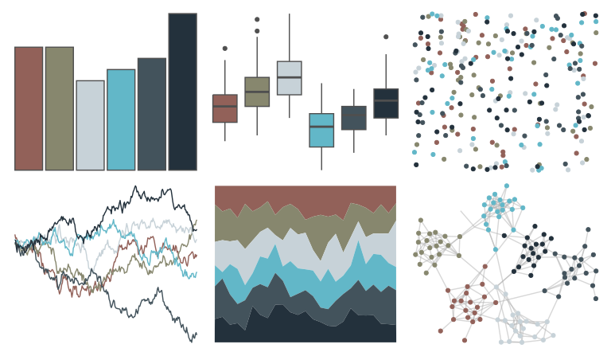

# DresdenColor - deathmasks 

::: columns
::: {.column width="50%"}

**Github**

[katiesaund/DresdenColor](https://github.com/katiesaund/DresdenColor)
:::

::: {.column width="50%"}

**CRAN**

Not on CRAN
:::
:::

<hr> 

Use with [paletteer](https://emilhvitfeldt.github.io/paletteer/) package:

```r
library(paletteer)
paletteer_d("DresdenColor::deathmasks")
```

Use raw:

```r
c("#926159FF", "#87876EFF", "#C7D2D8FF", "#62B7C8FF", "#43535CFF", "#23313CFF")
``` 

 

<br>

# Related Palettes

<div class="list" style="display: grid; grid-template-columns: auto auto auto;"> <figure class="figure">
<a href="../../awtools/a_palette/"> </a>
</figure> <figure class="figure">
<a href="../../Manu/Korora/"> </a>
</figure> <figure class="figure">
<a href="../../rtist/hokusai/"> </a>
</figure> <figure class="figure">
<a href="../../nord/baie_mouton/"> </a>
</figure> <figure class="figure">
<a href="../../DresdenColor/whitenight/"> </a>
</figure> <figure class="figure">
<a href="../../NatParksPalettes/RockyMtn/"> </a>
</figure> <figure class="figure">
<a href="../../palettetown/wobbuffet/"> </a>
</figure> <figure class="figure">
<a href="../../ochRe/parliament/"> </a>
</figure> <figure class="figure">
<a href="../../DresdenColor/deadbeat/"> </a>
</figure> <figure class="figure">
<a href="../../lisa/TheovanDoesburg/"> </a>
</figure> <figure class="figure">
<a href="../../ggprism/waves2/"> </a>
</figure> <figure class="figure">
<a href="../../calecopal/grasswet/"> </a>
</figure> 
</div>
