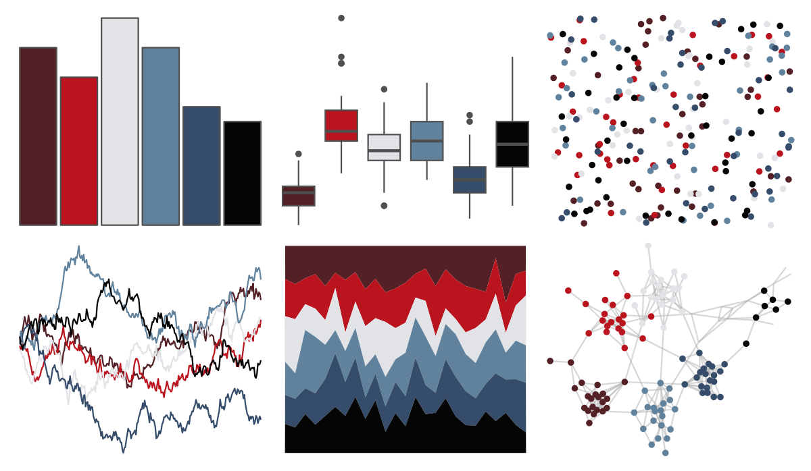

# DresdenColor - foolmoon 

::: columns
::: {.column width="50%"}

**Github**

[katiesaund/DresdenColor](https://github.com/katiesaund/DresdenColor)
:::

::: {.column width="50%"}

**CRAN**

Not on CRAN
:::
:::

<hr> 

Use with [paletteer](https://emilhvitfeldt.github.io/paletteer/) package:

```r
library(paletteer)
paletteer_d("DresdenColor::foolmoon")
```

Use raw:

```r
c("#532026FF", "#BA141EFF", "#E2E3E7FF", "#61829CFF", "#354C6AFF", "#050505FF")
``` 

 

<br>

# Related Palettes

<div class="list" style="display: grid; grid-template-columns: auto auto auto;"> <figure class="figure">
<a href="../../awtools/a_palette/"> </a>
</figure> <figure class="figure">
<a href="../../ButterflyColors/hamadryas_feronia/"> </a>
</figure> <figure class="figure">
<a href="../../ButterflyColors/hamadryas_feronia/"> </a>
</figure> <figure class="figure">
<a href="../../severance/HideAndSeek/"> </a>
</figure> <figure class="figure">
<a href="../../DresdenColor/ghoststory/"> </a>
</figure> <figure class="figure">
<a href="../../futurevisions/jupiter/"> </a>
</figure> <figure class="figure">
<a href="../../severance/TheYouYouAre/"> </a>
</figure> <figure class="figure">
<a href="../../nbapalettes/clippers_city/"> </a>
</figure> <figure class="figure">
<a href="../../futurevisions/mars/"> </a>
</figure> <figure class="figure">
<a href="../../Manu/Tui/"> </a>
</figure> <figure class="figure">
<a href="../../colRoz/i_lesueurii/"> </a>
</figure> <figure class="figure">
<a href="../../lisa/HilmaafKlint/"> </a>
</figure> 
</div>
