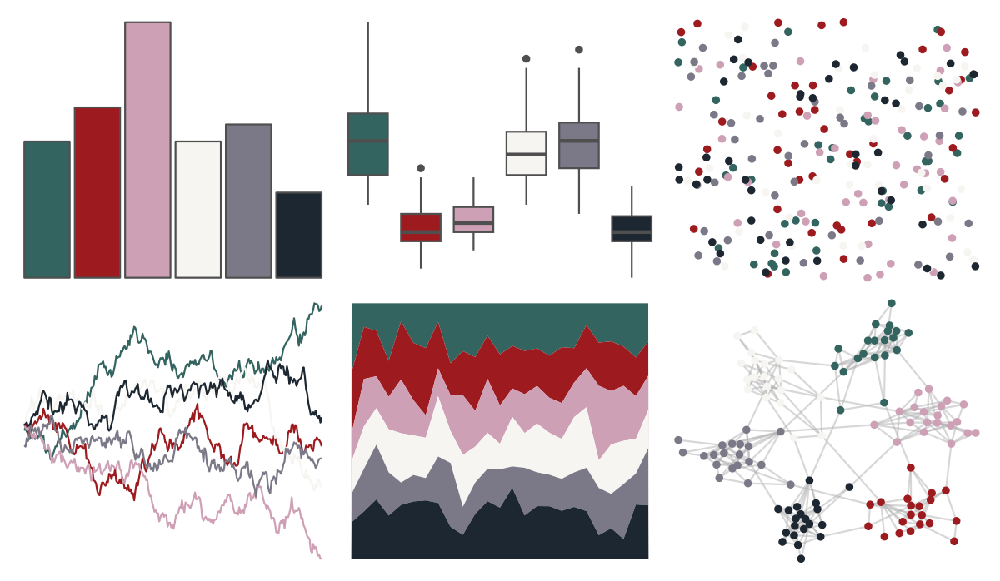

# DresdenColor - ghoststory 

::: columns
::: {.column width="50%"}

**Github**

[katiesaund/DresdenColor](https://github.com/katiesaund/DresdenColor)
:::

::: {.column width="50%"}

**CRAN**

Not on CRAN
:::
:::

<hr> 

Use with [paletteer](https://emilhvitfeldt.github.io/paletteer/) package:

```r
library(paletteer)
paletteer_d("DresdenColor::ghoststory")
```

Use raw:

```r
c("#33645FFF", "#9D1B1FFF", "#CEA0B5FF", "#F6F5F1FF", "#7B7987FF", "#1D2731FF")
``` 

 

<br>

# Related Palettes

<div class="list" style="display: grid; grid-template-columns: auto auto auto;"> <figure class="figure">
<a href="../../awtools/a_palette/"> </a>
</figure> <figure class="figure">
<a href="../../colRoz/i_lesueurii/"> </a>
</figure> <figure class="figure">
<a href="../../lisa/TheovanDoesburg/"> </a>
</figure> <figure class="figure">
<a href="../../futurevisions/jupiter/"> </a>
</figure> <figure class="figure">
<a href="../../DresdenColor/foolmoon/"> </a>
</figure> <figure class="figure">
<a href="../../nbapalettes/wizards_earned/"> </a>
</figure> <figure class="figure">
<a href="../../rtist/hokusai/"> </a>
</figure> <figure class="figure">
<a href="../../calecopal/tidepool/"> </a>
</figure> <figure class="figure">
<a href="../../palettetown/rhyhorn/"> </a>
</figure> <figure class="figure">
<a href="../../severance/HideAndSeek/"> </a>
</figure> <figure class="figure">
<a href="../../palettetown/cloyster/"> </a>
</figure> <figure class="figure">
<a href="../../ghibli/SpiritedMedium/"> </a>
</figure> 
</div>
