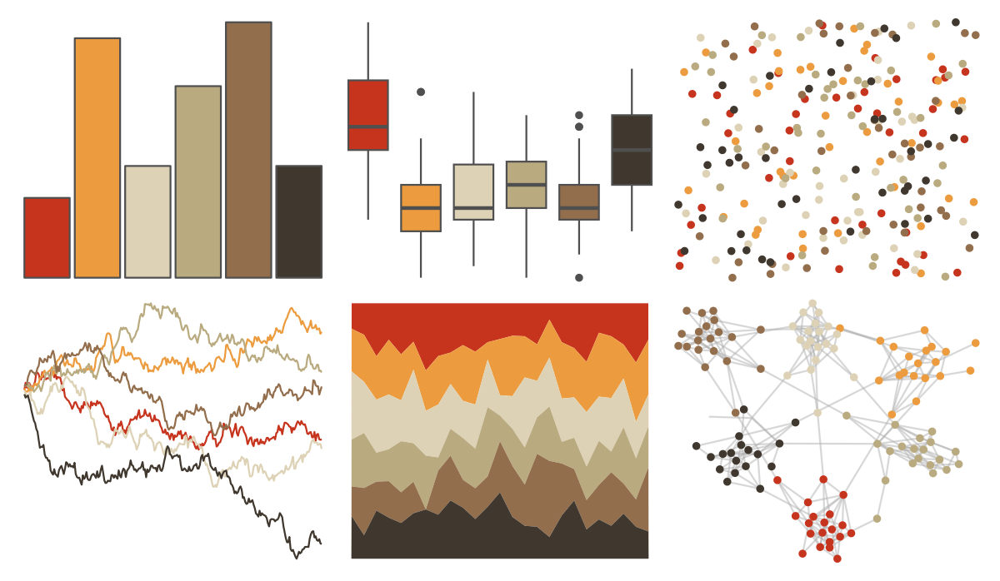

# DresdenColor - graveperil 

::: columns
::: {.column width="50%"}

**Github**

[katiesaund/DresdenColor](https://github.com/katiesaund/DresdenColor)
:::

::: {.column width="50%"}

**CRAN**

Not on CRAN
:::
:::

<hr> 

Use with [paletteer](https://emilhvitfeldt.github.io/paletteer/) package:

```r
library(paletteer)
paletteer_d("DresdenColor::graveperil")
```

Use raw:

```r
c("#C7341EFF", "#EC9C3EFF", "#DDD2B5FF", "#B9AA7FFF", "#936E4CFF", "#40382EFF")
``` 

 

<br>

# Related Palettes

<div class="list" style="display: grid; grid-template-columns: auto auto auto;"> <figure class="figure">
<a href="../../awtools/a_palette/"> </a>
</figure> <figure class="figure">
<a href="../../ButterflyColors/hamadryas_feronia/"> </a>
</figure> <figure class="figure">
<a href="../../ButterflyColors/hamadryas_feronia/"> </a>
</figure> <figure class="figure">
<a href="../../ButterflyColors/danaus_gilippus/"> </a>
</figure> <figure class="figure">
<a href="../../DresdenColor/sidejobs/"> </a>
</figure> <figure class="figure">
<a href="../../Redmonder/qMSOYlOr/"> </a>
</figure> <figure class="figure">
<a href="../../fishualize/Pterois_volitans/"> </a>
</figure> <figure class="figure">
<a href="../../ButterflyColors/lycorea_hallia/"> </a>
</figure> <figure class="figure">
<a href="../../colRoz/v_acanthurus/"> </a>
</figure> <figure class="figure">
<a href="../../colRoz/whitei/"> </a>
</figure> <figure class="figure">
<a href="../../lisa/CharlesDemuth/"> </a>
</figure> <figure class="figure">
<a href="../../colRoz/flavolineata/"> </a>
</figure> 
</div>
