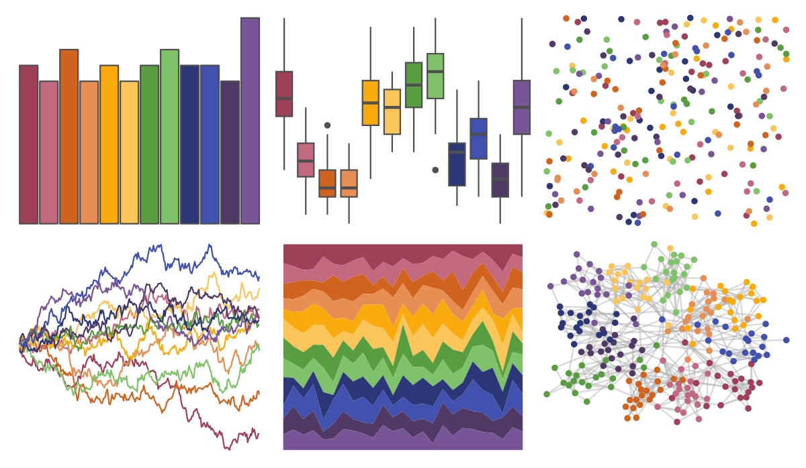

# DresdenColor - paired 

::: columns
::: {.column width="50%"}

**Github**

[katiesaund/DresdenColor](https://github.com/katiesaund/DresdenColor)
:::

::: {.column width="50%"}

**CRAN**

Not on CRAN
:::
:::

<hr> 

Use with [paletteer](https://emilhvitfeldt.github.io/paletteer/) package:

```r
library(paletteer)
paletteer_d("DresdenColor::paired")
```

Use raw:

```r
c("#9E4058FF", "#C2697FFF", "#D0641EFF", "#E68E54FF", "#F9AB0EFF", "#FBC559FF", "#589E40FF", "#7FC269FF", "#2C3778FF", "#4151B0FF", "#513965FF", "#785596FF")
``` 

 

<br>

# Related Palettes

<div class="list" style="display: grid; grid-template-columns: auto auto auto;"> <figure class="figure">
<a href="../../amerika/Dem_Ind_Rep3/"> </a>
</figure> <figure class="figure">
<a href="../../rcartocolor/Bold/"> </a>
</figure> <figure class="figure">
<a href="../../MetBrewer/Signac/"> </a>
</figure> <figure class="figure">
<a href="../../MetBrewer/Renoir/"> </a>
</figure> <figure class="figure">
<a href="../../rcartocolor/Prism/"> </a>
</figure> <figure class="figure">
<a href="../../ggthemes/Classic_Cyclic/"> </a>
</figure> <figure class="figure">
<a href="../../MetBrewer/Redon/"> </a>
</figure> <figure class="figure">
<a href="../../rcartocolor/Vivid/"> </a>
</figure> <figure class="figure">
<a href="../../MoMAColors/Klein/"> </a>
</figure> <figure class="figure">
<a href="../../palettetown/starmie/"> </a>
</figure> <figure class="figure">
<a href="../../ggthemr/flat/"> </a>
</figure> <figure class="figure">
<a href="../../tidyquant/tq_light/"> </a>
</figure> 
</div>
