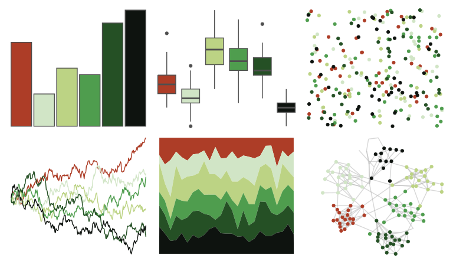

# DresdenColor - provenguilty 

::: columns
::: {.column width="50%"}

**Github**

[katiesaund/DresdenColor](https://github.com/katiesaund/DresdenColor)
:::

::: {.column width="50%"}

**CRAN**

Not on CRAN
:::
:::

<hr> 

Use with [paletteer](https://emilhvitfeldt.github.io/paletteer/) package:

```r
library(paletteer)
paletteer_d("DresdenColor::provenguilty")
```

Use raw:

```r
c("#AD3D27FF", "#D1E5C6FF", "#BCD384FF", "#4F9D4EFF", "#255025FF", "#0E130FFF")
``` 

 

<br>

# Related Palettes

<div class="list" style="display: grid; grid-template-columns: auto auto auto;"> <figure class="figure">
<a href="../../awtools/a_palette/"> </a>
</figure> <figure class="figure">
<a href="../../colRoz/nq_stream/"> </a>
</figure> <figure class="figure">
<a href="../../colRoz/p_mitchelli/"> </a>
</figure> <figure class="figure">
<a href="../../ggthemr/grass/"> </a>
</figure> <figure class="figure">
<a href="../../calecopal/agriculture/"> </a>
</figure> <figure class="figure">
<a href="../../wesanderson/Cavalcanti1/"> </a>
</figure> <figure class="figure">
<a href="../../calecopal/wetland/"> </a>
</figure> <figure class="figure">
<a href="../../nbapalettes/bucks_earned/"> </a>
</figure> <figure class="figure">
<a href="../../tayloRswift/taylorSwift/"> </a>
</figure> <figure class="figure">
<a href="../../calecopal/desert/"> </a>
</figure> <figure class="figure">
<a href="../../calecopal/sage/"> </a>
</figure> <figure class="figure">
<a href="../../fishualize/Ostorhinchus_angustatus/"> </a>
</figure> 
</div>
