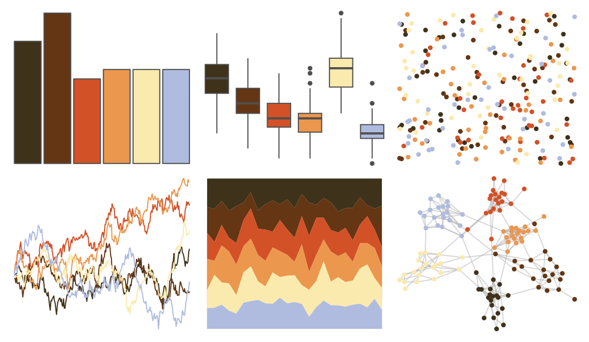

# DresdenColor - skingame 

::: columns
::: {.column width="50%"}

**Github**

[katiesaund/DresdenColor](https://github.com/katiesaund/DresdenColor)
:::

::: {.column width="50%"}

**CRAN**

Not on CRAN
:::
:::

<hr> 

Use with [paletteer](https://emilhvitfeldt.github.io/paletteer/) package:

```r
library(paletteer)
paletteer_d("DresdenColor::skingame")
```

Use raw:

```r
c("#3E321AFF", "#643613FF", "#D35127FF", "#EB974EFF", "#FAEAADFF", "#AFBBDFFF")
``` 

 

<br>

# Related Palettes

<div class="list" style="display: grid; grid-template-columns: auto auto auto;"> <figure class="figure">
<a href="../../awtools/a_palette/"> </a>
</figure> <figure class="figure">
<a href="../../fishualize/Nemateleotris_magnifica/"> </a>
</figure> <figure class="figure">
<a href="../../MetBrewer/Paquin/"> </a>
</figure> <figure class="figure">
<a href="../../colRoz/flavolineata/"> </a>
</figure> <figure class="figure">
<a href="../../beyonce/X58/"> </a>
</figure> <figure class="figure">
<a href="../../colRoz/l_vestiens/"> </a>
</figure> <figure class="figure">
<a href="../../soilpalettes/podzol/"> </a>
</figure> <figure class="figure">
<a href="../../lisa/SandroBotticelli_1/"> </a>
</figure> <figure class="figure">
<a href="../../colRoz/ngadju/"> </a>
</figure> <figure class="figure">
<a href="../../Redmonder/qMSOYl/"> </a>
</figure> <figure class="figure">
<a href="../../futurevisions/grand_tour/"> </a>
</figure> <figure class="figure">
<a href="../../fishualize/Trimma_lantana/"> </a>
</figure> 
</div>
