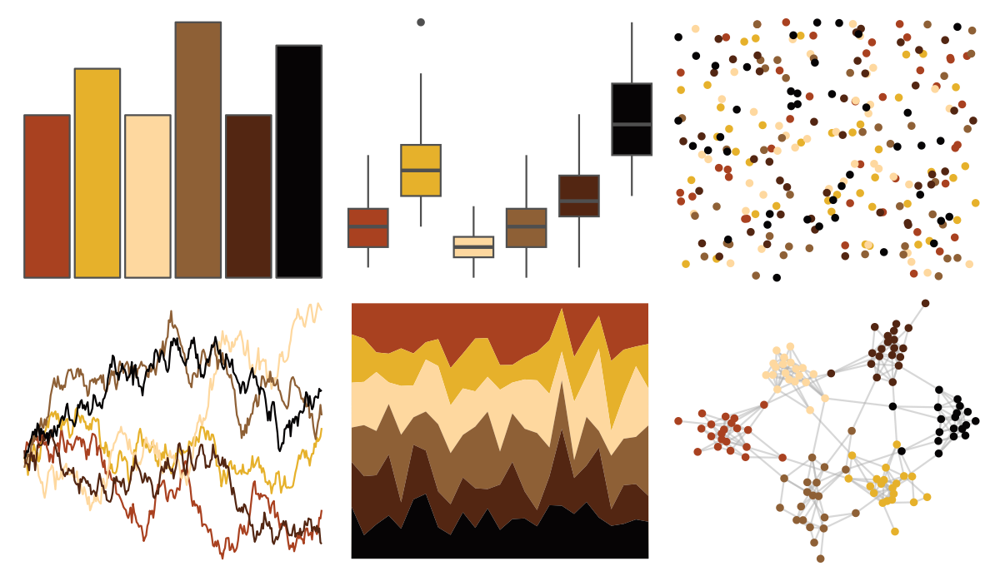

# DresdenColor - smallfavor 

::: columns
::: {.column width="50%"}

**Github**

[katiesaund/DresdenColor](https://github.com/katiesaund/DresdenColor)
:::

::: {.column width="50%"}

**CRAN**

Not on CRAN
:::
:::

<hr> 

Use with [paletteer](https://emilhvitfeldt.github.io/paletteer/) package:

```r
library(paletteer)
paletteer_d("DresdenColor::smallfavor")
```

Use raw:

```r
c("#A94120FF", "#E6B12BFF", "#FED89FFF", "#8E6036FF", "#532612FF", "#060405FF")
``` 

 

<br>

# Related Palettes

<div class="list" style="display: grid; grid-template-columns: auto auto auto;"> <figure class="figure">
<a href="../../awtools/a_palette/"> </a>
</figure> <figure class="figure">
<a href="../../feathers/superb_fairy_wren/"> </a>
</figure> <figure class="figure">
<a href="../../DresdenColor/changes/"> </a>
</figure> <figure class="figure">
<a href="../../lisa/Rembrandt/"> </a>
</figure> <figure class="figure">
<a href="../../feathers/spotted_pardalote/"> </a>
</figure> <figure class="figure">
<a href="../../fishualize/Pterois_volitans/"> </a>
</figure> <figure class="figure">
<a href="../../DresdenColor/stormfront/"> </a>
</figure> <figure class="figure">
<a href="../../fishualize/Aulostomus_chinensis/"> </a>
</figure> <figure class="figure">
<a href="../../fishualize/Salvelinus_fontinalis/"> </a>
</figure> <figure class="figure">
<a href="../../colRoz/t_nigrolutea/"> </a>
</figure> <figure class="figure">
<a href="../../DresdenColor/sidejobs/"> </a>
</figure> <figure class="figure">
<a href="../../colRoz/e_leuraensis/"> </a>
</figure> 
</div>
