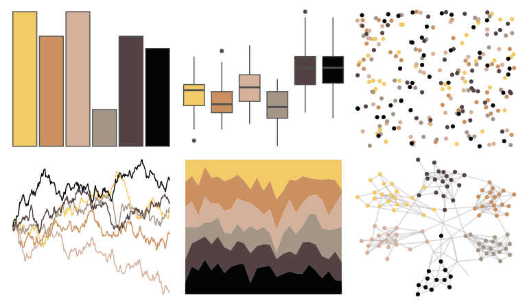

# DresdenColor - stormfront 

::: columns
::: {.column width="50%"}

**Github**

[katiesaund/DresdenColor](https://github.com/katiesaund/DresdenColor)
:::

::: {.column width="50%"}

**CRAN**

Not on CRAN
:::
:::

<hr> 

Use with [paletteer](https://emilhvitfeldt.github.io/paletteer/) package:

```r
library(paletteer)
paletteer_d("DresdenColor::stormfront")
```

Use raw:

```r
c("#F3CB66FF", "#CB9060FF", "#D5B09AFF", "#A59587FF", "#544142FF", "#030504FF")
``` 

 

<br>

# Related Palettes

<div class="list" style="display: grid; grid-template-columns: auto auto auto;"> <figure class="figure">
<a href="../../awtools/a_palette/"> </a>
</figure> <figure class="figure">
<a href="../../colRoz/t_nigrolutea/"> </a>
</figure> <figure class="figure">
<a href="../../fishualize/Pterois_volitans/"> </a>
</figure> <figure class="figure">
<a href="../../feathers/spotted_pardalote/"> </a>
</figure> <figure class="figure">
<a href="../../Manu/Takapu/"> </a>
</figure> <figure class="figure">
<a href="../../colRoz/p_cincta/"> </a>
</figure> <figure class="figure">
<a href="../../nationalparkcolors/Saguaro/"> </a>
</figure> <figure class="figure">
<a href="../../lisa/CharlesDemuth/"> </a>
</figure> <figure class="figure">
<a href="../../DresdenColor/smallfavor/"> </a>
</figure> <figure class="figure">
<a href="../../wesanderson/Moonrise2/"> </a>
</figure> <figure class="figure">
<a href="../../DresdenColor/graveperil/"> </a>
</figure> <figure class="figure">
<a href="../../feathers/superb_fairy_wren/"> </a>
</figure> 
</div>
