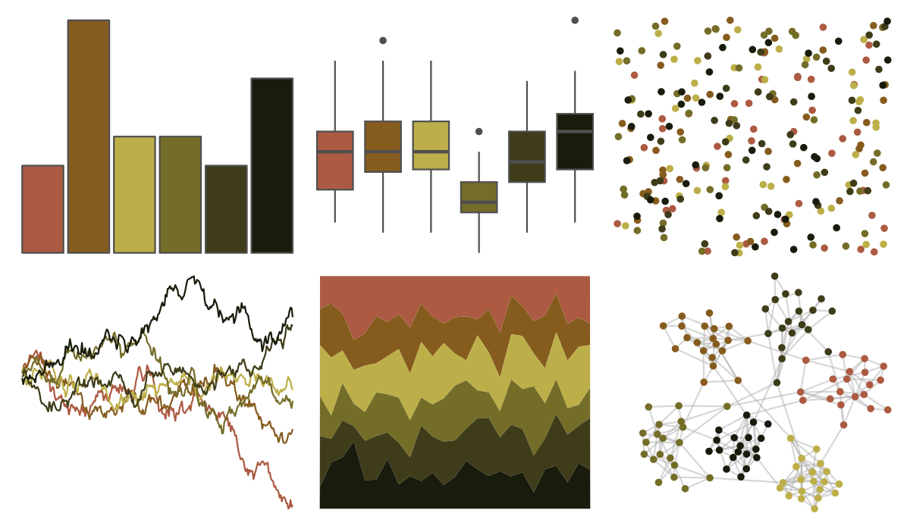

# DresdenColor - summerknight 

::: columns
::: {.column width="50%"}

**Github**

[katiesaund/DresdenColor](https://github.com/katiesaund/DresdenColor)
:::

::: {.column width="50%"}

**CRAN**

Not on CRAN
:::
:::

<hr> 

Use with [paletteer](https://emilhvitfeldt.github.io/paletteer/) package:

```r
library(paletteer)
paletteer_d("DresdenColor::summerknight")
```

Use raw:

```r
c("#AC5A42FF", "#865C1EFF", "#BCAF49FF", "#746D28FF", "#3E3C19FF", "#191C0CFF")
``` 

 

<br>

# Related Palettes

<div class="list" style="display: grid; grid-template-columns: auto auto auto;"> <figure class="figure">
<a href="../../amerika/Dem_Ind_Rep3/"> </a>
</figure> <figure class="figure">
<a href="../../poisonfrogs/Llineatus/"> </a>
</figure> <figure class="figure">
<a href="../../poisonfrogs/Hcinerascens/"> </a>
</figure> <figure class="figure">
<a href="../../DresdenColor/turncoat/"> </a>
</figure> <figure class="figure">
<a href="../../poisonfrogs/Ptomopterna/"> </a>
</figure> <figure class="figure">
<a href="../../lisa/Rembrandt/"> </a>
</figure> <figure class="figure">
<a href="../../fishualize/Anisotremus_virginicus/"> </a>
</figure> <figure class="figure">
<a href="../../colRoz/whitei/"> </a>
</figure> <figure class="figure">
<a href="../../MetBrewer/Degas/"> </a>
</figure> <figure class="figure">
<a href="../../fishualize/Pterois_volitans/"> </a>
</figure> <figure class="figure">
<a href="../../poisonfrogs/Opcolon/"> </a>
</figure> <figure class="figure">
<a href="../../poisonfrogs/Pvaillantii/"> </a>
</figure> 
</div>
