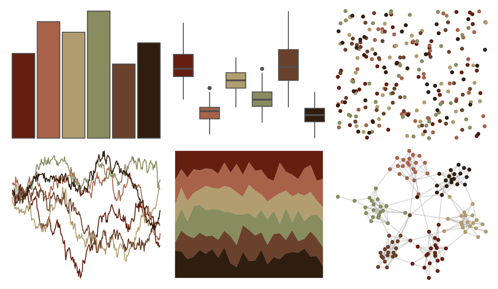

# DresdenColor - turncoat 

::: columns
::: {.column width="50%"}

**Github**

[katiesaund/DresdenColor](https://github.com/katiesaund/DresdenColor)
:::

::: {.column width="50%"}

**CRAN**

Not on CRAN
:::
:::

<hr> 

Use with [paletteer](https://emilhvitfeldt.github.io/paletteer/) package:

```r
library(paletteer)
paletteer_d("DresdenColor::turncoat")
```

Use raw:

```r
c("#651F10FF", "#A86249FF", "#B19D6FFF", "#888D60FF", "#6A412AFF", "#2F1E0FFF")
``` 

 

<br>

# Related Palettes

<div class="list" style="display: grid; grid-template-columns: auto auto auto;"> <figure class="figure">
<a href="../../amerika/Dem_Ind_Rep3/"> </a>
</figure> <figure class="figure">
<a href="../../ButterflyColors/historis_acheronta/"> </a>
</figure> <figure class="figure">
<a href="../../ButterflyColors/smyrna_blomfidiana/"> </a>
</figure> <figure class="figure">
<a href="../../ButterflyColors/danaus_erippus/"> </a>
</figure> <figure class="figure">
<a href="../../ButterflyColors/battus_polydamas/"> </a>
</figure> <figure class="figure">
<a href="../../colRoz/desert_flood/"> </a>
</figure> <figure class="figure">
<a href="../../beyonce/X102/"> </a>
</figure> <figure class="figure">
<a href="../../lisa/DiegoVelazquez/"> </a>
</figure> <figure class="figure">
<a href="../../Rdune/maythyknifechipandshatter/"> </a>
</figure> <figure class="figure">
<a href="../../poisonfrogs/Llineatus/"> </a>
</figure> <figure class="figure">
<a href="../../DresdenColor/summerknight/"> </a>
</figure> <figure class="figure">
<a href="../../colRoz/a_conica/"> </a>
</figure> 
</div>
