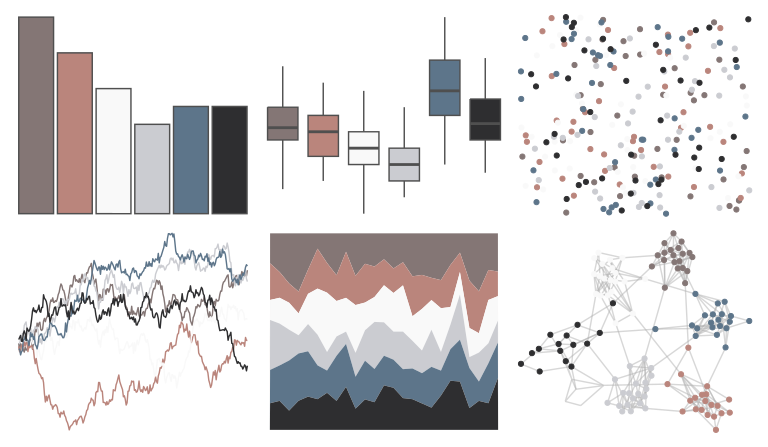

# DresdenColor - whitenight 

::: columns
::: {.column width="50%"}

**Github**

[katiesaund/DresdenColor](https://github.com/katiesaund/DresdenColor)
:::

::: {.column width="50%"}

**CRAN**

Not on CRAN
:::
:::

<hr> 

Use with [paletteer](https://emilhvitfeldt.github.io/paletteer/) package:

```r
library(paletteer)
paletteer_d("DresdenColor::whitenight")
```

Use raw:

```r
c("#847675FF", "#BA857CFF", "#F9F9F9FF", "#CBCCD1FF", "#5D758AFF", "#2E2E30FF")
``` 

 

<br>

# Related Palettes

<div class="list" style="display: grid; grid-template-columns: auto auto auto;"> <figure class="figure">
<a href="../../awtools/a_palette/"> </a>
</figure> <figure class="figure">
<a href="../../palettetown/poliwhirl/"> </a>
</figure> <figure class="figure">
<a href="../../ochRe/parliament/"> </a>
</figure> <figure class="figure">
<a href="../../DresdenColor/deathmasks/"> </a>
</figure> <figure class="figure">
<a href="../../palettetown/steelix/"> </a>
</figure> <figure class="figure">
<a href="../../palettetown/remoraid/"> </a>
</figure> <figure class="figure">
<a href="../../tayloRswift/taylor1989/"> </a>
</figure> <figure class="figure">
<a href="../../palettetown/poliwrath/"> </a>
</figure> <figure class="figure">
<a href="../../lisa/TheovanDoesburg/"> </a>
</figure> <figure class="figure">
<a href="../../palettetown/dewgong/"> </a>
</figure> <figure class="figure">
<a href="../../DresdenColor/deadbeat/"> </a>
</figure> <figure class="figure">
<a href="../../ggprism/waves2/"> </a>
</figure> 
</div>
