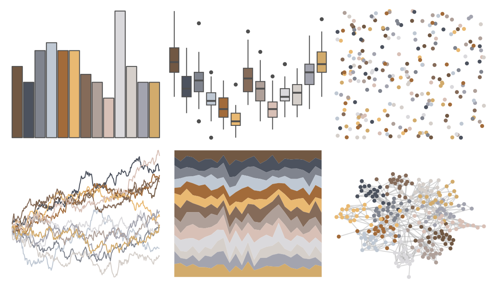

# IslamicArt - abu_dhabi 

::: columns
::: {.column width="50%"}

**Github**

[lambdamoses/IslamicArt](https://github.com/lambdamoses/IslamicArt)
:::

::: {.column width="50%"}

**CRAN**

Not on CRAN
:::
:::

<hr> 

Use with [paletteer](https://emilhvitfeldt.github.io/paletteer/) package:

```r
library(paletteer)
paletteer_d("IslamicArt::abu_dhabi")
```

Use raw:

```r
c("#715843FF", "#4C525EFF", "#80848EFF", "#BFC8D3FF", "#A26B3AFF", "#E9B972FF", "#856B59FF", "#AFA099FF", "#D8C0B6FF", "#DAD9DCFF", "#D5CFCAFF", "#A3A4AFFF", "#D2AB6CFF")
``` 

 

<br>

# Related Palettes

<div class="list" style="display: grid; grid-template-columns: auto auto auto;"> <figure class="figure">
<a href="../../amerika/Dem_Ind_Rep3/"> </a>
</figure> <figure class="figure">
<a href="../../IslamicArt/damascus/"> </a>
</figure> <figure class="figure">
<a href="../../palettetown/rhydon/"> </a>
</figure> <figure class="figure">
<a href="../../IslamicArt/samarqand/"> </a>
</figure> <figure class="figure">
<a href="../../palettetown/donphan/"> </a>
</figure> <figure class="figure">
<a href="../../dutchmasters/view_of_Delft/"> </a>
</figure> <figure class="figure">
<a href="../../ochRe/namatjira_div/"> </a>
</figure> <figure class="figure">
<a href="../../impressionist.colors/chanteuse_de_cafe_concert/"> </a>
</figure> <figure class="figure">
<a href="../../ochRe/namatjira_qual/"> </a>
</figure> <figure class="figure">
<a href="../../impressionist.colors/les_terrassiers/"> </a>
</figure> <figure class="figure">
<a href="../../palettetown/seel/"> </a>
</figure> <figure class="figure">
<a href="../../IslamicArt/jerusalem/"> </a>
</figure> 
</div>
