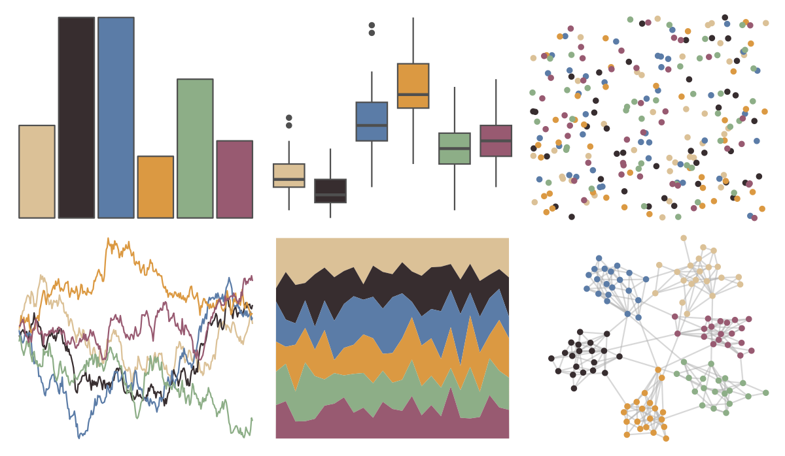

# IslamicArt - alhambra 

::: columns
::: {.column width="50%"}

**Github**

[lambdamoses/IslamicArt](https://github.com/lambdamoses/IslamicArt)
:::

::: {.column width="50%"}

**CRAN**

Not on CRAN
:::
:::

<hr> 

Use with [paletteer](https://emilhvitfeldt.github.io/paletteer/) package:

```r
library(paletteer)
paletteer_d("IslamicArt::alhambra")
```

Use raw:

```r
c("#DBC197FF", "#372D2FFF", "#5B7CA7FF", "#DB9942FF", "#8DAE87FF", "#985A71FF")
``` 

 

<br>

# Related Palettes

<div class="list" style="display: grid; grid-template-columns: auto auto auto;"> <figure class="figure">
<a href="../../awtools/a_palette/"> </a>
</figure> <figure class="figure">
<a href="../../ButterflyColors/hamadryas_feronia/"> </a>
</figure> <figure class="figure">
<a href="../../ButterflyColors/hamadryas_feronia/"> </a>
</figure> <figure class="figure">
<a href="../../Manu/Kotare/"> </a>
</figure> <figure class="figure">
<a href="../../ggthemes/excel_Headlines/"> </a>
</figure> <figure class="figure">
<a href="../../MoMAColors/Levine1/"> </a>
</figure> <figure class="figure">
<a href="../../fishualize/Epinephelus_marginatus/"> </a>
</figure> <figure class="figure">
<a href="../../MoMAColors/Rattner/"> </a>
</figure> <figure class="figure">
<a href="../../lisa/EdwardHopper/"> </a>
</figure> <figure class="figure">
<a href="../../NatParksPalettes/KingsCanyon/"> </a>
</figure> <figure class="figure">
<a href="../../lisa/Michelangelo/"> </a>
</figure> <figure class="figure">
<a href="../../lisa/JamesJean/"> </a>
</figure> 
</div>
