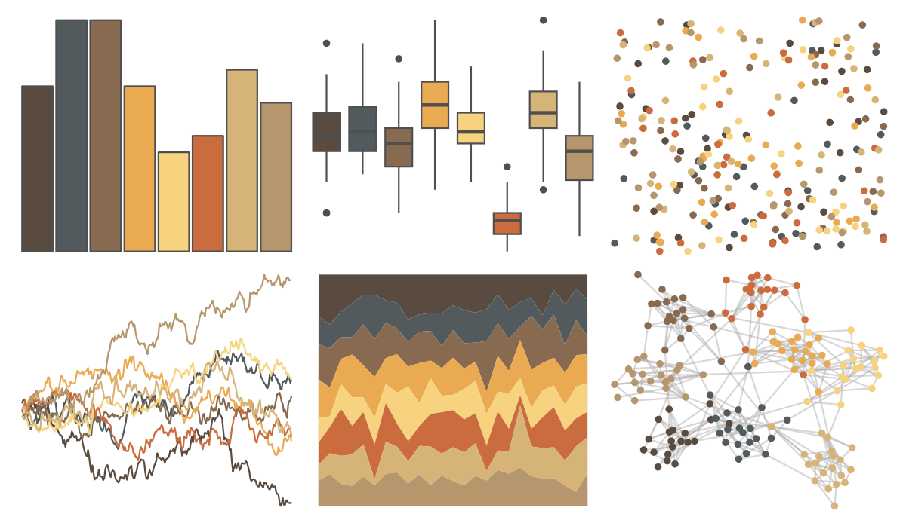

# IslamicArt - cordoba 

::: columns
::: {.column width="50%"}

**Github**

[lambdamoses/IslamicArt](https://github.com/lambdamoses/IslamicArt)
:::

::: {.column width="50%"}

**CRAN**

Not on CRAN
:::
:::

<hr> 

Use with [paletteer](https://emilhvitfeldt.github.io/paletteer/) package:

```r
library(paletteer)
paletteer_d("IslamicArt::cordoba")
```

Use raw:

```r
c("#594B3FFF", "#525A5EFF", "#886A50FF", "#E9AA52FF", "#F7D380FF", "#CA6C3DFF", "#D6B478FF", "#B6966CFF")
``` 

 

<br>

# Related Palettes

<div class="list" style="display: grid; grid-template-columns: auto auto auto;"> <figure class="figure">
<a href="../../awtools/a_palette/"> </a>
</figure> <figure class="figure">
<a href="../../IslamicArt/istanbul3/"> </a>
</figure> <figure class="figure">
<a href="../../fishualize/Acanthisthius_brasilianus/"> </a>
</figure> <figure class="figure">
<a href="../../palettetown/spinda/"> </a>
</figure> <figure class="figure">
<a href="../../PNWColors/Sunset/"> </a>
</figure> <figure class="figure">
<a href="../../ggthemes/Miller_Stone/"> </a>
</figure> <figure class="figure">
<a href="../../ghibli/PonyoMedium/"> </a>
</figure> <figure class="figure">
<a href="../../IslamicArt/damascus/"> </a>
</figure> <figure class="figure">
<a href="../../ggpomological/pomological_palette/"> </a>
</figure> <figure class="figure">
<a href="../../calecopal/dudleya/"> </a>
</figure> <figure class="figure">
<a href="../../nord/red_mountain/"> </a>
</figure> <figure class="figure">
<a href="../../palettetown/magcargo/"> </a>
</figure> 
</div>
