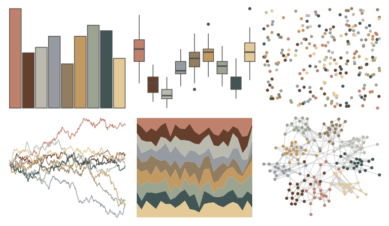

# IslamicArt - damascus 

::: columns
::: {.column width="50%"}

**Github**

[lambdamoses/IslamicArt](https://github.com/lambdamoses/IslamicArt)
:::

::: {.column width="50%"}

**CRAN**

Not on CRAN
:::
:::

<hr> 

Use with [paletteer](https://emilhvitfeldt.github.io/paletteer/) package:

```r
library(paletteer)
paletteer_d("IslamicArt::damascus")
```

Use raw:

```r
c("#BF816BFF", "#653F2CFF", "#BABAAFFF", "#959BA1FF", "#937D61FF", "#C29961FF", "#9AA490FF", "#415555FF", "#E3CA97FF")
``` 

 

<br>

# Related Palettes

<div class="list" style="display: grid; grid-template-columns: auto auto auto;"> <figure class="figure">
<a href="../../awtools/a_palette/"> </a>
</figure> <figure class="figure">
<a href="../../ggthemes/excel_Feathered/"> </a>
</figure> <figure class="figure">
<a href="../../IslamicArt/abu_dhabi/"> </a>
</figure> <figure class="figure">
<a href="../../nord/algoma_forest/"> </a>
</figure> <figure class="figure">
<a href="../../impressionist.colors/les_terrassiers/"> </a>
</figure> <figure class="figure">
<a href="../../ggthemes/excel_Crop/"> </a>
</figure> <figure class="figure">
<a href="../../IslamicArt/fes2/"> </a>
</figure> <figure class="figure">
<a href="../../feathers/oriole/"> </a>
</figure> <figure class="figure">
<a href="../../lisa/PaulCezanne/"> </a>
</figure> <figure class="figure">
<a href="../../ochRe/parliament/"> </a>
</figure> <figure class="figure">
<a href="../../calecopal/chaparral1/"> </a>
</figure> <figure class="figure">
<a href="../../tayloRswift/taylor1989/"> </a>
</figure> 
</div>
